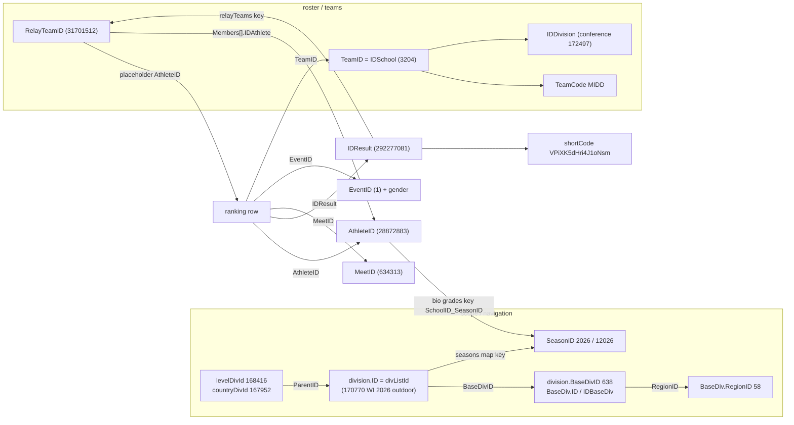

# 05. Athletic.net identifier graph

Status: complete
Observed on: 2026-09-19

Evidence base: two read-only browser HAR captures (both `www.athletic.net`, both taken in a signed-in
session on 2026-09-18), the retained pipeline repo (read-only), the retained delivery workbook, and two
live `curl` probes made from this machine on 2026-09-19 (`2026-09-20T04:18Z` UTC response header).
Nothing in this report was obtained by authenticating, replaying cookies, or solving a challenge; no
athlete contact field exists in any Athletic.net payload examined.

### Source

* Host `www.athletic.net` (Cloudflare-fronted), API namespace `/api/v1/*`, plus client routes served by
  the Angular SPA whose bundles live on `angular.athletic.net/app/site-app/*.js` (140 bundle URLs on that host;
  145 JS files total across both captures, all with retained bodies, ≈2.96 MB — the route/parameter templates
  below are read from those shipped bundles, not guessed).
* HAR #1 `www.athletic.net.har` — 16,791,461 bytes, sha256 `0e01076be987481286d6cb000f0fa154a07cce417296cfbb9521ac37dc0a1c20`,
  entries `2026-09-18T18:54:41Z`–`18:55:40Z`, 167 responses from `www.athletic.net` (all 200/204), 30 retained API JSON payloads.
  Page: `/TrackAndField/rankings/list/170770/m` (Wisconsin 2026 outdoor **boys**).
* HAR #2 `www.athletic.net2.har` — 7,902,430 bytes, sha256 `dba962b12223b7f694ec99034976bd81e01c4ee4318aa4d292619fa6a3c52b96`,
  entries `2026-09-18T19:20:59Z`–`19:21:18Z`, 141 responses from `www.athletic.net`, 11 retained API JSON payloads.
  Page: `/athlete/28872883/track-and-field` (biography of a single grade-11 Wisconsin athlete) plus a team page request.
* Repo (read-only): `src/runtime/rankings/catalog/division.rs`, `src/runtime/rankings/page/parse/relay.rs`,
  `src/runtime/rankings/types.rs`, `src/profile/bio.rs`, `src/profile/parser.rs`,
  `fixtures/public/athletic-source-contract.json`, `tests/fixtures/rankings/*`.
* Delivery workbook `/home/lewis/Downloads/Athletic-2026-US-Boys-Grade11-All-Athletes.xlsx`
  (10,147,760 bytes, sha256 `8f613143f7e8e3fe8d8833314a85536297674b9bc6fb2bf7d253d1cc40bcda21`, 142,705 rows,
  columns `AthleteID, Names, GradeID, Teams, States, Events, Result Count, Other Observed Grades, Identity Match Status`).
* Extractor: `tools/05-atn-id-graph.py` (stdlib only, read-only over the HARs) → emits `data/atn-id-fields.csv` (45 rows).

### Coverage

Proven by retained capture:

| Dimension | What is actually covered |
|---|---|
| Sport | Track & field. `resultsXC`/`distancesXC` keys exist (both `null` in HAR #2), XC route strings exist in bundles, but **no XC payload was captured** |
| Season | 2026 outdoor (all 707 ranking rows carry `SeasonID` 2026); bio adds 2025 outdoor. Nav `seasons` map covers 2006–2027 outdoor and 12007–12027 indoor (43 keys) |
| Gender | Boy-scoped rankings only (`gender:"m"`); girls event ids only via `GetConvertEvents` + repo fixtures |
| Geography | Wisconsin list `divListId` 170770 + nav catalogs (220 countries, 6 levels, 76 regions, 283 events) |
| Id surface | 45 distinct id-bearing fields catalogued (`data/atn-id-fields.csv`); value ranges measured over 707 rows from 9 `GetRankings` responses |
| Endpoint payloads | 41 API JSON payloads retained: 19 endpoint paths |
| Known hole | 2 `GetRankings` response bodies were **not** stored in HAR #1 (`#348` declared 88,676 B, `#539` declared 87,425 B — the 100m page-1 and page-4 event pages). Every count below is over the 707 retained rows, not those two pages |

Unproven / not attempted: girls rankings payloads, XC payloads, `meet/{id}/results` payloads, team-roster payloads,
`DownloadRankings` (see Incremental use), and whether any endpoint requires the `anettokens` header that three
`tfRankings` GETs carry (the data endpoints do not carry it).

### Enumeration

Every pattern below is a verbatim route/body observed in a HAR entry or read from a shipped bundle. `{...}` = substitution site.

1. **Division list discovery (scope resolver).** `GET /api/v1/tfRankings/GetNavInfo?seasonId={year}&level=4&gender={m|f}&recordSetId=0&locationId=0&teamId=0&indoor={true|false}`
   → returns `divListId` (selected scope), `levelDivId` 168416, `countryDivId` 167952, `regionDivId` (equal to `divListId` on a state page), `seasons` (43 entries keyed by season string), `countries` (220), `levels` (6), `regions` (76), `tree` (68 = Wisconsin's division tree), `events` (283) and `events_main` (36 ids). HAR #1 #154 and #354 are byte-identical responses (78,468 B) for the same URL.
2. **Row enumeration (the workhorse).** `POST /api/v1/tfRankings/GetRankings` body keys observed:
   `{"reportType":"div","mode":"list","divListId":170770,"indoor":null,"eventShort":"","gender":"m","qParams":{...},"qualifyingListKey":"","version":2,"debug":""}`.
   The bundle's client adds `recordSetId, locationId, teamId, listId, meetId` for other report modes (omitted when unused).
   `qParams` keys observed: `page` (int), `grades` (int array), `eventType` (int, 0 = all).
   * div mode (`eventShort:""`, no page) → 18 event groups × 10 rows = 180 rows, i.e. a top-10 preview.
   * event mode (`eventShort:"100m"`) → 102 rows per page; `minCount` reports the full match count for the exact filter set.
   * Pagination measured: page *k* returns ranks `[100(k-1) .. 100(k-1)+101]` clipped at `minCount` (page 2 → 100–201, page 3 → 200–301, page 10 → 900–1001, page 17 → 1600–1616 for `minCount` 1616). **Adjacent pages overlap by 2 ranks**; total pages = `ceil(minCount/100)`. The bundle sets the default depth the same way: `let n = this.rankingsInfo.eventId ? 100 : 10`.
   * Wisconsin 2026 boys 100m: `minCount` 2,117 unfiltered; **1,616** with `"grades":[11]` (17 pages, 17 requests).
3. **Athlete.** `GET /api/v1/AthleteBio/GetAthleteBioData?athleteId={id}&sport=tf&level=0` → `athlete, allSeasons, allTeams, grades, meets, resultsTF, eventsTF, relayTeamMembers, photos, synonyms, resultsXC, distancesXC, canEdit, level, hasOtherSport, unattachedCalendars`.
   Public page: `/athlete/{AthleteID}/{track-and-field|cross-country}` (client route + captured page URL).
4. **Athlete standing per division.** `GET /api/v1/General/GetRankings?athleteId={id}&sport=tf&seasonId={year}&truncate=true` → a **list of 21 standing rows** for the captured athlete, each `{Level, EventID, Event, EventShort, EventType, EventTypeID, SortInt, SortIntRaw, Fat, Measure, Position, IDDivision, DivName, SchoolID}` (HAR #2 #135, 6,122 B). `IDDivision` is the scope (`0` with `DivName "Team"`, then the athlete's `170776` "Regional 2A - Sauk Prairie", `170775` "Sectional …" chain) and `Position` is the standing in that scope — the cheapest way to read an athlete's competitive level without a ranking-list sweep.
5. **Team.** `GET /api/v1/TeamNav/Team?team={TeamID}&sport=tf&season={year}` → `team{ID,Name,Level,TeamCode,hasIndoor,State,Country,...}`, `divisions[]` (id/baseId/name chain), `customDivisions[]`, `linkedTeams[]`, `grades`.
   Public page: `/team/{TeamID}/track-and-field-outdoor|track-and-field-indoor|cross-country` (`team-header.component-DfX5ODlT.js` `setUrls()`).
6. **Team roster by association division (no name search needed).** `GET /api/v1/SiteHeader/GetDivChildren?sport=tf&divId={listId}` → `teams[]{IDDivision, IDSchool, SchoolName}` + `divInfo[]{DivIDDivision, IDBaseDiv, ...}`. With `divId=170771` (Wisconsin Division 1) it returns 1,962 B of child scopes (Sectional 1 = 170772 …).
7. **Grade/age universes per scope.** `POST /api/v1/tfRankings/GetAgesGrades` body `{"recordSetId":0,"locationId":0,"teamId":0,"listId":0,"seasonId":2026,"restrict":false,"includeEvents":[{"eventId":1,"eventTypeId":0},…]}` → `grades[]{ID,GradeCount}`, `ages[]{...}`. Retained counts: grades 9/10/11/12 = 22,934 / 21,535 / **19,725** / 16,436, plus cohorts 6,7,8 (12/23/66) and 21–24 (19/21/25/17). The request carried `listId:0`, so whether the counts bind to the selected site/state list or to the level cannot be settled from the payload alone; magnitude cross-check: the workbook holds 3,962 Wisconsin grade-11 boys for its event set, ≈0.20× the 19,725 all-gender count [INFERENCE — treat as list-scope counts to be calibrated by re-issuing with an explicit id].
8. **Breadcrumbs.** `GET /api/v1/SiteHeader/GetBreadcrumbs?sport=tf&athleteId=&meetId=&calendarId=&divId=170770&teamId=&seasonId=` → breadcrumb items whose `id`/`BaseDivID` give the same base-division anchor as the row payload.
9. **Standards.** `GET /api/v1/tfRankings/GetStandards?recordsetId=null&eventId=1&eventTypeId=0` → `[]` (2 bytes) — no qualifying-standard data in this scope.
10. **Event conversions.** `GET /api/v1/tfRankings/GetConvertEvents` → 171 `{FromEventID,ToEventID,Gender}` mappings (23,613 B), i.e. the only cross-sport/gender event equivalence table in the capture.
11. **Search.** `POST /Search.aspx/runSearch` with `{q, fq:"t:a a:tf", start}` (repo contract only; no HAR capture — one request per query, returns name+id rows).
12. **Client route table (from `tf-rankings.routes-CeE2uDyE.js`).** `/rankings/list/:divListId/:gender[/:eventShort]` → `{reportType:'div',mode:'list'}`; `/rankings/records/:recordSetId/:gender[/:eventShort]`; `/rankings/ratings/:divId/:gender`; `/rankings/:qualifyingListKey/:divListId/:gender[/:eventShort]` → `mode:'qualifying'`. Result permalink is `/result/{shortCode}` (`http://www.athletic.net/result/` + `result.shortCode` in `athlete-bio.routes-BYYQfvXR.js`), meet page root `/TrackAndField/meet/${meet.ID}` (`chunk-BXK99FuV2.js`).

Scope map (state list ids rotate per season, resolve through `GetNavInfo.seasons` every season):

| Scope | 2026 outdoor | 2026 indoor | 2027 outdoor | 2027 indoor | 2025 outdoor | 2025 indoor |
|---|---|---|---|---|---|---|
| USA High School (repo fixture + nav) | 168,416 | 173,005 | — | — | — | — |
| Wisconsin (`divListId` from nav) | 170,770 | 175,082 | 181,951 | 187,407 | 159,762 | 164,008 |

Nav `seasons` map observed keys: outdoor `"2006"…"2027"` (22), indoor `"12007"…"12027"` (21), values `815`("2006") … `187407`("12027") — list ids are **not** arithmetic, so always read the map.

### Stable identifiers

Full 45-row catalog with per-field sample values and request citations: `data/atn-id-fields.csv`. Condensed:

| Identifier | Where it appears (request → field) | Observed type/range | Uniqueness scope | Stability |
|---|---|---|---|---|
| `AthleteID` | `GetRankings` → `groupedRankings[][].AthleteID`; `GetAthleteBioData` → `athlete.IDAthlete`, `resultsTF[].AthleteID` | u64, 11,050,467–33,263,826 in capture; workbook holds 142,705 distinct values | Global person namespace across sports/levels | Stable; the only identity key. Name is not |
| `AthleteID` (relay placeholder) | `GetRankings` relay rows | 31,701,512–32,725,060 = the row's `RelayTeamID` | **Not an athlete**; set equality with `RelayTeamID` verified (40 rows, 38 distinct) | Structural, not numeric: relay row ⇔ `GradeID==99` ∧ `PersonalEvent==false` ∧ `relayTeams[IDResult].RelayTeamID == row.AthleteID` |
| `IDAthlete` (relay member) | `relayTeams[IDResult].Members[].IDAthlete`; bio `relayTeamMembers[].AthleteID` | 14,691,532–33,263,826 | Real athletes, same namespace as `AthleteID` | Stable |
| `RelayTeamID` | `relayTeams[IDResult].RelayTeamID` | 31,701,512–32,725,060 | Squad id (team×season-ish), **not** an entry id — one squad id appears in several relay events (e.g. 32,402,984 in 4x100 and 4x200 for team 3272) | Stable within a season; use `IDResult` for the entry |
| `IDResult` | `GetRankings` → `groupedRankings[][].IDResult`; `relayTeams` object key (string form); bio `resultsTF[].IDResult` | u64, 275,996,286–299,118,609 | Global result-entry namespace; the same value appears in ranking pages, bio and relay map | Stable; the de-duplication key. 707 rows → 705 distinct in capture (page overlap) |
| `TeamID` | `GetRankings` → `[].TeamID`; `TeamNav/Team?team=`; bio `allTeams` key | 0 or 2,836–101,206 | School-instance (school × level) namespace; **`0` = unattached** (4 rows in capture carry free-text `TeamName` such as `Unattached`, `Wausau-WI`) | Stable across seasons; `Level` 2 = middle school linked teams share the namespace (Glacier Creek 57,750 / Kromrey 57,810 linked to Middleton 3,204) |
| `IDSchool` / `SchoolID` | bio `resultsTF[].SchoolID`, `allTeams[].IDSchool`, `grades` map key; `GetDivChildren.teams[].IDSchool` | 2,836–101,206 | Same namespace as `TeamID` (bio `SchoolID` 3204 ≡ rankings `TeamID` 3204 "Middleton", verified on athlete 28,872,883) | Stable |
| `TeamCode` | `TeamNav/Team` → `team.TeamCode` (`MIDD`) | 4-char mnemonic | Human-facing only; not unique across states/years | Stable-ish; never a key |
| `MeetID` | `GetRankings` → `[].MeetID`; bio `meets` key / `IDMeet` | 620,489–670,436 in ranking pages (314 distinct); bio 594,374–667,524 (7 meets in 2025: 594,374–615,580; 11 in 2026: 622,393–667,524) | Global meet-instance namespace | Stable; monotone with time (see Incremental use) |
| `EventID` | `GetRankings` → `[].EventID`; bio `resultsTF[].EventID`; `eventsTF[].IDEvent` | 1–60 in capture; 283 events catalogued, 36 in `events_main` | **Gender-qualified**: 200m = 2 (boys) / 20 (girls); 4x100 = 7 / 25; 800 = 3 / 21; 4x400 = 8 / 26; 39/67, 50/51, 52/53, 60/61 also paired | Stable; join on (gender, EventID) |
| `EventTypeID` / `IDEventType` | `GetRankings`, bio `eventsTF` | **0 on all 707 ranking rows and on all 5 bio `eventsTF` metadata rows** | Not usable as a track/field discriminator here | Use `EventType` `"T"`/`"F"` (647/60) and `EventTypeDescription` (`39" / 0.991m`, `12lb`, `1.6kg`) |
| `GradeID` | `GetRankings` → `[].GradeID`; bio `grades["{SchoolID}_{SeasonID}"]`; relay `Members[].GradeID` | 9,10,11,12 + `99` relay placeholder; `GetAgesGrades` also 6,7,8,21–24 | Season-scoped observation about (athlete, team, season) — 0 rows of the workbook carry >1 `GradeID`, but 499 carry an **Other Observed Grades** value (12, 10, `undefined`, 9, `null`, 7, 8, 23, 24, 2, 1) | Re-read each season |
| `SeasonID` | `GetRankings` → `[].SeasonID`; `division.SeasonID`; bio `allSeasons[].IDSeason` | 2026 outdoor; indoor = 10,000 + year (12,026); repo `SeasonKind::season_id` and the SPA (`indoor: division()?.SeasonID > 1e4`) agree | Global season namespace | Stable encoding |
| `division.ID` / `divListId` | `GetRankings` request body + payload `division.ID`; `GetNavInfo.divListId` | 170,770 = Wisconsin 2026 outdoor | Per (scope × season × kind); one list serves both genders | **Rotates every season** — resolve via `seasons` map; store `BaseDivID` alongside |
| `division.ParentID` | payload-level `division` object | 168,416 (HS level list) for 170,770 | Parent scope chain | Stable-ish |
| `division.BaseDivID` / `BaseDiv.ID` | payload-level `division`; `.../result/{...}` breadcrumbs `BaseDivID`; `GetDivChildren.divInfo[].IDBaseDiv` | 638 = Wisconsin (BaseDiv `{ParentID:2, Type:"State", Level:4, RegionID:58, State:"WI", hasXC:true, featureIndoor:true}`) | Stable association/state anchor across list rotations | **Stable** — the correct long-lived division key |
| `DivIDDivision` | `GetDivChildren.divInfo[].DivIDDivision` | 170,772 = Sectional 1 | Child (sectional/regional) list ids | Rotates with the season |
| `IDDivision` (team membership, athlete standing) | `TeamNav/Team.customDivisions[].IDDivision` (172,497 = Big Eight); `General/GetRankings[].IDDivision` | per-conference/division | Membership/standing scope | Rotates |
| `RegionID` | `division.BaseDiv.RegionID` | 58 = Wisconsin | Association/region grouping | Stable — note `division.EventSelectionID` is also 58 here; **same value, different namespace** |
| `EventSelectionID` | payload-level `division.EventSelectionID` | 58 (outdoor WI) | Selects the event set a list ranks over | Stable-ish |
| `recordSetId` / `locationId` / `calendarId` / `qualifyingListKey` | `GetStandards`, `GetNavInfo`, `GetBreadcrumbs`, `GetRankings` body; client routes | 0 / 0 / 0 / `""` | Record-set, venue, calendar and custom-list scopes; `qualifyingListKey` is a **string** ("all-time" etc. absent in capture) | Scopes, not entities |
| `shortCode` | `GetRankings` → `[].shortCode`; bio `resultsTF[].shortCode` | e.g. `VPiXK5dHri4J1oNsm`, `BMiAAK8U3FOM3Apcg` | Per-result public permalink key, independent of `IDResult` | Stable; the human/shareable key |
| `Handle` | `GetRankings` → `[].Handle` (408/707 rows); relay `Members[].Handle` | e.g. `AntonioJackson4` | Account-chosen, nullable, **not unique** | Unstable (user-editable) |
| `UserId`, `IdUAthlete`, `LinkID`, `ReplacementID`/`SourceID` | `SignedInUser/GetSignedInUser`, `GetUserAthletes2` | **field names only reported here** | Account namespace, distinct from `AthleteID` | Not recruiting data; do not collect |
| `UsatfId` | bio `athlete.UsatfId` | `null` for the captured athlete | External membership id | Nullable |

#### Join graph

#### Edge table

| From | To | Field / rule | Cardinality | Evidence |
|---|---|---|---|---|
| `AthleteID` | ranking rows | `groupedRankings[][].AthleteID` | 1 : N (over seasons/meets/events) | HAR #1 #147 etc.; 667 rows / 630 distinct |
| `AthleteID` | `TeamID` | `[].TeamID`; bio `resultsTF[].SchoolID` (same namespace) | N : 1 per row; athletes can hold many over time | bio SchoolID 3204 ≡ TeamID 3204 verified on IDResult 292277081 |
| `AthleteID` | `GradeID` | bio `grades["{SchoolID}_{SeasonID}"]` (e.g. `3204_2026`→11, `3204_2025`→10) | N : 1 per (team, season) | HAR #2 #127; repo `types.rs` |
| `AthleteID` | `SeasonID` | bio `allSeasons[{SchoolID,IDSeason,Display,Selected}]` | N : 1 per season | 2 seasons for the captured athlete |
| `TeamID` | division scopes | `TeamNav/Team.divisions[]` chain (167952→168416→170770→170771→170775→170776), `customDivisions[].IDDivision` | N : N | HAR #2 #134 |
| `division.ID` (list) | child lists | `GetDivChildren.divInfo[].DivIDDivision` + `IDBaseDiv` | 1 : N | HAR #2 #166 (`divId=170771`) |
| `division.ID` | `BaseDivID` | payload `division.BaseDivID` / breadcrumbs | N : 1 | HAR #1 #147; `GetBreadcrumbs` rows |
| `division.ID` | `SeasonID` | `division.SeasonID`; nav `seasons[seasonKey] = divListId` | N : 1 both directions per (state × kind) | nav: 2026→170770, 12026→175082, 12027→187407 |
| `IDResult` | ranking row | `[].IDResult` | 1 : 1 | 707 rows / 705 distinct (overlap only) |
| `IDResult` | bio result | bio `resultsTF[].IDResult` | 1 : 1 | 2 of 53 bio rows matched ranking rows (292277081, 294454627) |
| `IDResult` | relay roster | `relayTeams["<IDResult>"]` (string key) | 1 : 0..1 | 40 rosters for 40 relay rows |
| `relayTeams[IDResult]` | row | `IDResult` and `RelayTeamID` both must equal the row's values | 1 : 1 | repo `page/parse/relay.rs` enforces both equalities; HAR confirms 40/40 |
| `RelayTeamID` | `AthleteID` (placeholder) | `row.AthleteID == roster.RelayTeamID`, `row.GradeID == 99`, `row.PersonalEvent == false` | 1 : 1 placeholder | 40/40; set equality True |
| `RelayTeamID` | member `AthleteID`s | `Members[].IDAthlete` (4 each; `GradeID` 9/10/11/12 = 2/19/43/96) | 1 : 4 | HAR #1 relay groups |
| bio `relayTeamMembers[].TeamID` | `RelayTeamID` | bio's field **named** `TeamID` holds squad ids 29,163,596–32,663,276 | N : 1 | disjoint from school `TeamID` set (max 101,206) — a naming trap |
| `MeetID` | bio meet | `meets["<MeetID>"].IDMeet` | 1 : 1 | 18 meets for the captured athlete |
| `EventID` | event metadata | bio `eventsTF[].IDEvent`; nav `events[]`/`events_main[]` | N : 1 | `eventsTF[0]` = {IDEvent 1, "100 Meters", Type "T", ConversionInt 240} |
| `EventID` | gender | numeric pairing (2/20, 3/21, 4/22, 7/25, 8/26, 39/67, 50/51, 52/53, 60/61) | 1 : 1 | `GetConvertEvents` (171 mappings) + repo fixture |
| `AthleteID` | division standing | `General/GetRankings?athleteId=` → standing rows `{IDDivision, DivName, Position, EventID, SchoolID}` | 1 : N | HAR #2 #135 (21 rows) |
| `IDResult` | `shortCode` | `[].shortCode` → `/result/{shortCode}` | 1 : 1 | bundle route literal + bio `result_url` build in repo `bio.rs` |
| `TeamID` | public page | `/team/{TeamID}/track-and-field-outdoor`, `.../-indoor`, `/cross-country` | 1 : 1 | `team-header.component-DfX5ODlT.js` `setUrls()` |
| `AthleteID` | public page | `/athlete/{AthleteID}/track-and-field` | 1 : 1 | captured page URL HAR #2 #0; `athlete-bio.routes` |
| `MeetID` | public page | `/TrackAndField/meet/{MeetID}` (+ `/results/...`) | 1 : 1 | `chunk-BXK99FuV2.js` `rootPath` literal |

#### Collisions and multiplicity

* **Namespace collision (structural, not numeric).** `RelayTeamID` (31,701,512–32,725,060) lies *inside* the
  `AthleteID` band (11,050,467–33,263,826). In the captured data the two sets are disjoint (`RelayTeamID ∩ real
  AthleteID = ∅`, `∩ relay member AthleteID = ∅`), but a range test cannot separate them: classify a row as relay
  by `GradeID == 99` ∧ `PersonalEvent == false` ∧ `relayTeams["<IDResult>"].RelayTeamID == row.AthleteID`, never by magnitude.
* **Field-name trap.** Bio `relayTeamMembers[].TeamID` holds relay-squad ids (29,163,596–32,663,276), which are
  disjoint from school `TeamID`s (≤101,206) — the same field name means two different entities across arrays.
  In ranking rows the school rides `TeamID`; in bio rows it rides `SchoolID`; there is no row carrying both.
* **Duplicate names.** Delivery workbook: 133,661 distinct name strings; 5,945 name groups cover 14,989 distinct
  `AthleteID`s (e.g. "Benjamin Harris" = 4 ids). Even (name, team) is not sufficient: 38 (name, team) pairs map to
  2 distinct `AthleteID`s each (e.g. ("Connor Garcia","Unattached")). `AthleteID` is the only safe key.
* **Same athlete across seasons / grades.** The same `AthleteID` carries per-season grade rows (`3204_2025`→10,
  `3204_2026`→11) and multiple `allSeasons` entries; a grade-11 filter alone is season-bound, and 499 workbook
  athletes additionally carry a conflicting secondary grade (12/10/9/8/7/23/24, plus literal `undefined`/`null`).
* **Transfers / multi-team athletes.** 3,931 workbook rows list more than one team string, 45 list more than one
  state (and 33,631 list at least one relay event). Unattached participation is a *pseudo-team*, not a school:
  1,848 workbook rows and 4 capture rows carry `TeamID = 0` with free-text names (`Unattached`, `Wausau-WI`), and
  those rows carry no `State`/`Country`.
* **School-family coupling and the unattached bucket.** `TeamNav.linkedTeams` returned feeder/middle schools in
  the same namespace (`Level` 2: Glacier Creek 57,750, Kromrey 57,810 linked to Middleton 3,204), so a `TeamID` is
  a school-*instance*, not a program — read `Level`/`BaseDiv` before assuming high school. Within the retained
  pages the name mapping was otherwise clean (293 non-zero `TeamID`s ↔ 293 distinct team names, 1:1), and `TeamID`
  0 was the many-names-one-id case (`Unattached`, `Wausau-WI`, `Milton-WI`).
* **Relay squads are reusable.** One `RelayTeamID` is bound to several relay events for the same team and season
  (32,402,984 in 4x100 and 4x200 for team 3272; 32,381,599 for team 3201), so an (athlete, `RelayTeamID`) pair is
  not an entry — `IDResult` is.
* **Unified vs split programs unproven.** Nothing in the captured payloads distinguishes a co-op/unified program
  from a single school (no such field was found); school-identity and program-identity reconciliation has to come
  from the association sources (state agents) or from the repo's own identity matcher. Recorded as a coverage gap,
  not as an inference.

### Athletic.net leverage

The graph's value is that **one ranking row already carries five foreign keys at zero extra cost** —
`AthleteID, TeamID, MeetID, EventID, IDResult` (+ `shortCode`) — so seeding any downstream store needs no
lookups: a state-list sweep is a bulk *and* a join. Concretely:

* `TeamID` + `GetDivChildren` enumerate every school in an association division **without any name search**;
  `TeamNav/Team` then gives the team's own division chain and level (HS vs middle school).
* `MeetID` + `EventID` + `GradeID` are exactly the acquisition keys the pipeline needs to fetch only the
  meets that can contain grade-11 marks (assignment 03 owns the meet endpoints; this report supplies the keys).
* `AthleteID` + `IDResult` are the reconciliation keys for every other source: any external page that shows an
  Athletic.net profile URL or a result permalink can be resolved to `AthleteID`/`IDResult` deterministically, so
  external discovery (MileSplit, DirectAthletics, association results) can be spent *instead of* Athletic.net
  list sweeps, and Athletic.net requests can then be spent only on the athletes that survived reconciliation.
* Cost shape observed: one Wisconsin grade-11 boys 100m list = 17 requests for 1,616 rows (`minCount` 2,117
  unfiltered). A 12-state × 2-gender × 36-main-event sweep would be ~864 lists; at the observed 10–20 pages
  per event that is ≈9k–17k requests for a whole season of Midwest grade-11 marks [INFERENCE from the two
  measured `minCount` values and the 100-row page depth]. Compare with the workbook's 142,705 athlete rows /
  397,867 results nationally, where per-athlete profile fetches would be 1 request per athlete: **the graph is
  what lets a per-athlete budget be replaced by a per-list budget**.
* A bulk export endpoint exists in the shipped client — `POST /api/v1/tfRankings/DownloadRankings` with the same
  body shape as `GetRankings` and `responseType:'blob'`, filename `Rankings_{reportType}_{key}_{gender}_{date}.json`
  — but its button is role-gated (`ANetRoles.Division_DownloadRankings`) and **no call appears in either HAR**
  [UNVERIFIED: read from `chunk-yZ2mAgBc.js`; not exercised]. Worth one probe from an authorized account;
  do not plan capacity around it.

### Athlete evidence

Availability per endpoint (`AthleteID` is available everywhere except the account endpoints, which are out of contract):

| Field | `GetRankings` row | `GetAthleteBioData` | `General/GetRankings` | Notes |
|---|---|---|---|---|
| Name | `AthleteName` (relay rows: ` ` blob) | `athlete.FirstName/LastName` | — | relay blob matched roster order in 39/40 rows; parse `relayTeams[].Members[]` instead |
| Grade | `GradeID` (11 = 416/707 rows) | `grades["{SchoolID}_{SeasonID}"]` | `GradeID` | season-scoped; 499/142,705 workbook athletes also carry a conflicting Other Observed Grades value |
| Age | `Age` (195/707 rows: 16–19) | `athlete.age` (null here) | — | not a proxy for grade |
| School | `TeamName` + `TeamID` (+ `TeamMascot` = logo URL) | `SchoolID`, `allTeams[].SchoolName`, `resultsTF[].SchoolID` | `SchoolID` | `TeamID` 0 ⇒ unattached, no state |
| City/state | `State`, `Country` (703/707 filled) | via `allTeams` | — | 4 unattached rows carry neither |
| Gender | implicit in request `gender` + event id | `athlete.Gender` ("M") | — | not a row field |
| Sport / season kind | request `eventShort` + `SeasonID` | `allSeasons[].Display` ("2026 Outdoor"), `level` | `seasonId` param | XC keys present but null |
| Performances | one row per (meet, event, mark) | `resultsTF[]` (53 rows) / `resultsXC` (null) | — | |
| Result detail | `display`, `Result`-equivalent `SortInt*`, `FAT`, `Wind`, `Round`, `MediaCountJson` | `Result`, `SortInt`, `SortIntRaw`, `Place`, `Division`, `Exhibition`, `MediaCount`, `shortCode` | — | see Result evidence |
| PB / SB flags | `PersonalBest` (bitfield int) | `PersonalBest`, `SeasonBest` | — | season best absent from ranking rows |
| Progression | `ResultDate` across rows | `allSeasons` + `meets` map | division standing | |
| Meets | `MeetID`, `MeetName` | `meets[MeetID]{MeetName,EndDate}`, `meetName` per row (null) | — | |
| Profile URL | `AthleteID` → `/athlete/{id}/track-and-field` | `canEdit`, `isClaimed`, `PhotoUrl`, `Handle` | — | `NoSearch` flag exists on the athlete record |
| Contact data | **none** | **none** | — | the bio payload contains no email/phone/address field; the account endpoints (`GetSignedInUser`, `GetUserAthletes2`) do carry account PII and are excluded from collection |

Class-of-2027 derivation: an `AthleteID` with `GradeID == 11` in a 2026-season row (outdoor `SeasonID` 2026 or
indoor `SeasonID` 12026) is the Class of 2027; the binding is per (athlete, team, season) because the same
`AthleteID` can carry 10 in 2025 and 11 in 2026 (verified: `grades` = `{3204_2025:10, 3204_2026:11}`), and a
second school's row would carry its own key.

### Recruiting information

**Not applicable for this source.** No coach, athletic director, staff, or contact field appears in any of the
41 retained Athletic.net payloads; `GetSignedInUser` / `GetUserAthletes2` / `GetUserTeams2` describe the
*signed-in account* (a parent/coach/athlete account) and are not school staff directories. What Athletic.net
does contribute to the contact graph is a school anchor: `TeamID`/`IDSchool` + `TeamNav` metadata
(`Name, Level, State, Country, TeamCode, hasIndoor`) plus the association website carried on the division
object (`division.Website = "http://www.wiaawi.org"` for Wisconsin). Coach/AD contact discovery must come from
the association sources (assignments 29 and the state agents).

### Result evidence

Ranking-row census (707 rows, 9 responses):

| Field | Presence | Observed values |
|---|---|---|
| `IDResult` | 707 | u64, unique 705 (overlap) |
| `AthleteID` | 707 | 630 distinct athletes (+38 relay placeholders) |
| `MeetID` / `MeetName` | 707 | 314 meets, e.g. 667,524 "WIAA State Track & Field Championships" |
| `EventID` / `EventShort` / `Event` | 707 | 100m (537), 200m/400m/800m (10 each) … |
| `EventType` | 707 | `T` 647 / `F` 60 |
| `EventTypeID` | 707 | **0 always** (do not use) |
| `EventTypeDescription` | 50 | `39" / 0.991m`, `36" / 0.914m`, `12lb`, `1.6kg` — hurdle height / implement spec |
| mark | 707 | `display` (e.g. `11.21`, `64.62m`), `display_secondary` (60 rows, field-event imperial e.g. `6' 7"`) |
| normalised | 707 | `SortIntRaw`, `SortIntCalc`, `SortIntOrig` (equal on this capture), `Measure` (`E` 401 / `" "` 270 / `M` 36), `ConversionInt` (240 = 557, 0 = 120, 140 = 30) |
| timing | 707 | `FAT` = 1 on every row (no hand-time row in capture) |
| wind | 50 | e.g. `0.0`, `0.8`, `-1.3`; absent otherwise |
| round | 707 | `Round` `F` 605 / `P` 102 |
| place | (bio only) | bio `resultsTF[].Place` e.g. `"1"`, plus `Division`/`DivisionShort` (`Varsity`/`V`) and `Exhibition` bool |
| date | 707 | `ResultDate` ISO midnight, e.g. `2026-05-26T00:00:00` |
| school represented | 707 | `TeamID` (+ bio `SchoolID`) |
| PB/SB | 707 | `PersonalBest` values 0/14/16/30; `SeasonBest` **absent** from ranking rows (present on bio rows, e.g. 0). Both are `OpaqueFlags` in the repo — **not booleans** |
| media | 707 | `MediaCountJson` `{"photos":2}` etc., `mediaCount` object; bio `MediaCount` |
| permalink | 707 | `shortCode` |
| relay membership | 40 rows | `relayTeams[IDResult]{RelayTeamID, Members[4], IDResult, ...}`; bio `relayTeamMembers[]{TeamID(squad), AthleteID, Name, SortID}` |

Cross-endpoint normalisation is **not** uniform: the same `IDResult` 292,277,081 is `Result "10.41a", SortInt 10401`
in the bio payload and `display "10.41", SortIntRaw/SortIntCalc 10410` in the ranking page. Store the raw
integer plus its source endpoint, or recompute from `display`; never compare `SortInt` across endpoints.
Field-name casing is likewise inconsistent — ranking rows and bio rows use `FAT`, `General/GetRankings` uses
`Fat` — so parsers must match case-insensitively or per-endpoint.
`Place` exists only on bio rows and `rank`/`rowNum` only on ranking rows — ranking position is a query artifact.

### Incremental use

* **No `updatedAt`/cursor field exists** in any payload. Two usable watermarks:
  * `MeetID` — monotone with time in the captured data (bio: 7 meets in 2025 span 594,374–615,580, 11 meets in 2026
    span 622,393–667,524; ranking pages carry 620,489–670,436 for 2026).
  * `IDResult` — monotone with time in the captured data: 258,445,410 (2025-05-01) < 275,996,286 (2026) < 292,277,081 (2026-05-15) < 294,089,454 (2026-05-26) < 299,118,609 (2026-06-06) [INFERENCE from 5 points; treat both as local watermarks, re-derive each refresh]. Store `max(IDResult)` and `max(MeetID)` seen and treat rows at or below as already known.
* **Season rotation**: `divListId` changes every season (Wisconsin 2025:159,762 → 2026:170,770 → 2027:181,951; indoor 12025:164,008 → 12026:175,082 → 12027:187,407). Always start a refresh by re-reading `GetNavInfo` and looking up `seasons["{year}"]` / `seasons["1{year}"]`; never hardcode a list id. Persist `division.BaseDivID` (638) as the durable anchor.
* **Page arithmetic**: `minCount` from page 1 gives `ceil(minCount/100)` pages; each page overlaps its
  predecessor by 2 ranks and repeats `rowNum`/`rank`, so dedupe on `IDResult` (observed 707 → 705). A grade
  filter changes `minCount` materially (2,117 → 1,616 for WI boys 100m), so store the filter set with the watermark.
* **Cheap overlap-aware refresh**: for a known list, fetch page 1, and only continue until the page's
  `IDResult` set is fully contained in the store (ranks shift when marks improve, so rank alone is not a
  watermark) — this bounds a steady-state refresh to 1–3 requests per list.
* **Scope binding**: rows are already scoped by `divListId` + `gender` + `eventShort` + `qParams.grades`; keep
  that tuple as the partition key, together with `SeasonID`, so a national/level sweep (168,416) and a state
  sweep (170,770) never mix. `GetAgesGrades` gives per-grade population counts for the same scope tuple and is
  the natural "is my enumeration complete?" check.
* **Team/meet roll-ups instead of per-athlete fetches**: because every row carries `TeamID` and `MeetID`, an
  incremental refresh can fetch a touched meet once (assignment 03 endpoints) and credit all its athletes,
  instead of one bio request per athlete.

### Access characteristics

* Public, structured JSON API (`/api/v1/*`), browser application, Cloudflare in front. All 308 `www.athletic.net`
  responses in the two HARs were 200/204 — **no 429 and no `Retry-After` observed anywhere**, so no rate-limit
  signal is available from this evidence; the polite budget (~50 requests/host, sequential) must be imposed client-side.
* Auth shape: `GetRankings`, `AthleteBio`, `TeamNav`, `General/GetRankings`, `GetDivChildren`,
  `GetBreadcrumbs` carry **no** `authorization` header and **no** `anettokens` header; the `anettokens` header
  appears only on `tfRankings/GetNavInfo`, `GetAgesGrades` and `GetStandards` (three GET paths). `request.cookies`
  is empty for all 41 captured API calls — either the site needed no cookie for them or the HAR export dropped
  it; **not decidable from this artifact**. Both captures were made while signed in (`GetSignedInUser` 200 in both),
  and two payloads are account-contextual: bio `synonyms` carried `IDAthlete 987411` — the *viewer's* record —
  while the page's athlete was 28,872,883, and `TLog/GetInitialLogData2?athleteId=987411` is the viewer's log.
  Never treat `synonyms`, follow lists, `canEdit`, `isClaimed` or the `TLog` payloads as facts about the viewed athlete.
* Live reachability from this machine, 2026-09-19 (response header `date: Sun, 20 Sep 2026 04:18:46 GMT`):
  * `curl` with default headers → **403** Cloudflare interstitial ("Just a moment…", 5,493 B for the HTML route,
    5,921 B for the API route), `cf-mitigated: challenge`, `server: cloudflare`, plus `critical-ch`/`accept-ch`
    client-hint challenges. This holds for both `GET /api/v1/tfRankings/GetNavInfo?...` and
    `GET /TrackAndField/rankings/list/170770/m`.
  * One characterisation probe that set a browser-like `User-Agent` (disclosed for completeness; **no data was
    extracted from it and no challenge was solved**): the HTML route returned the 7,529-byte SPA shell (200,
    no data — the shell is JS-only), while the API route returned 403 with an **empty** body. The API is
    blocked to this machine either way.
  * Conclusion for the pipeline: the Cloudflare block is at the edge, not the application — the ID graph above is
    therefore only usable through the project's browser transport (or the retained captures).
* Payload weights (for budget math): nav 78,468 B; states 34,159 B; conversions 23,613 B; ranking pages
  16.7–191 KB (page 1 div-mode 191 KB / event pages ≈84–89 KB); bio 30,344 B; `General/GetRankings` 6,122 B;
  `TeamNav/Team` 1,222 B; `GetStandards` 2 B; `GetAgesGrades` 1,080 B.

### Recommendation

**ATHLETIC.NET-SEED — the identifier graph is the acquisition substrate; it should be captured once per
(state × gender × season × event) and then used as a key store, not re-scraped.**

1. Persist the five keys from every ranking row (`AthleteID, TeamID, MeetID, EventID, IDResult` + `shortCode`) with the scope tuple
   (`divListId, BaseDivID, gender, seasonKey, eventShort, grades`) and `ResultDate`. Dedupe on `IDResult`.
2. Resolve every season by re-reading `GetNavInfo` and the `seasons` map; anchor on `division.BaseDivID`
   (never on `divListId`, which rotates). Bind sport/gender at the join level: `(gender, EventID)`, never `EventID` alone.
3. Treat `AthleteID` as the only athlete identity key. Name is not: 5,945 name groups in the delivery workbook
   cover 14,989 athletes, and 38 (name, team) pairs still map to 2 distinct `AthleteID`s. Grade is not: it is a
   `(SchoolID, SeasonID)`-scoped observation, and 499 workbook athletes carry a conflicting secondary grade value.
4. Never parse relay display names (`AthleteName` ` ` blob) — join through `relayTeams["<IDResult>"]`,
   verify `RelayTeamID == row.AthleteID` and `GradeID == 99`, and read members from `Members[].IDAthlete`.
   Note the naming trap: bio `relayTeamMembers[].TeamID` is a relay squad id, not a school.
5. Do not decode `PersonalBest`/`SeasonBest` as booleans (observed 0/14/16/30 on TF; the repo stores them as
   `OpaqueFlags`, XC uses booleans); do not use `EventTypeID` (always 0) — use `EventType` `T`/`F` and
   `EventTypeDescription` for hurdle height / implement weight. Do not compare `SortInt` across endpoints.
6. Budget: a Midwest sweep of grade-11 lists is ~864 event lists for 12 states × 2 genders × 36 main events;
   use `minCount` + `ceil(minCount/100)` pages per list, stop early on all-known `IDResult`s, and prefer
   team/meet roll-ups over per-athlete bio requests. Zero extra requests are needed to discover keys, because
   every row carries them.
7. Do not plan capacity on `DownloadRankings` (role-gated, unexercised); treat the two unretained ranking
   response bodies as a known capture hole when validating any count derived from HAR #1.

### Evidence appendix

Live probes (this machine, 2026-09-19; UTC response header `Sun, 20 Sep 2026 04:18:46 GMT`):

| URL | method | HTTP status | what it proved | timestamp |
|---|---|---|---|---|
| `https://www.athletic.net/api/v1/tfRankings/GetNavInfo?seasonId=2026&level=4&gender=m&recordSetId=0&locationId=0&teamId=0&indoor=false` | GET (default curl) | 403 | API blocked at the edge: Cloudflare challenge body, 5,921 B, `cf-mitigated: challenge` | 2026-09-20T04:18:46Z |
| `https://www.athletic.net/TrackAndField/rankings/list/170770/m` | GET (default curl) | 403 | HTML route also challenged: "Just a moment…", 5,493 B | 2026-09-20T04:18:46Z |
| same API URL | GET (browser-like UA probe, disclosed) | 403 | API stays blocked; body empty (0 B) | 2026-09-20T04:18:45Z |
| same HTML URL | GET (browser-like UA probe, disclosed) | 200 | Only the 7,529 B SPA shell is served; no data | 2026-09-20T04:18:45Z |

HAR-derived API requests (`www.athletic.net`; both captures 2026-09-18; all 200 unless noted):

| URL (query shown where captured) | method | status | HAR entry | payload bytes | time (UTC) |
|---|---|---|---|---|---|
| `/api/v1/tfRankings/GetNavInfo?seasonId=2026&level=4&gender=m&recordSetId=0&locationId=0&teamId=0&indoor=false` | GET | 200 | har1 #154,354 | 78,468 | 18:54:42Z … 18:54:45Z |
| `/api/v1/tfRankings/GetRankings` | POST | 200 | har1 #147,348,414,478,539,587,622,656,704 | 16,709–191,003 | 18:54:42Z … 18:55:20Z |
| `/api/v1/tfRankings/GetAgesGrades` | POST | 200 | har1 #153,353 | 1,080 | 18:54:42Z … 18:54:45Z |
| `/api/v1/public/GetStatesCountries2` | GET | 200 | har1 #155; har2 #147 | 34,159 | 18:54:42Z / 19:21:00Z |
| `/api/v1/tfRankings/GetStandards?recordsetId=null&eventId=1&eventTypeId=0` | GET | 200 | har1 #340,409,417,481,542,590,625,660,707 | 2 (`[]`) | 18:54:43Z … 18:55:20Z |
| `/api/v1/SiteHeader/GetBreadcrumbs?sport=tf&athleteId=0&meetId=0&calendarId=0&divId=170770&teamId=0&seasonId=0` | GET | 200 | har1 #69,719 | 1,456 | 18:54:42Z … 18:55:40Z |
| `/api/v1/SiteHeader/GetDivChildren?sport=tf&divId=170771` | GET | 200 | har2 #166 | 1,962 | 19:21:18Z |
| `/api/v1/tfRankings/GetConvertEvents` | GET | 200 | har1 #718 | 23,613 | 18:55:30Z |
| `/api/v1/TeamNav/Team?team=3204&sport=tf&season=2026` | GET | 200 | har2 #134 | 1,222 | 19:21:00Z |
| `/api/v1/General/GetRankings?athleteId=28872883&sport=tf&seasonId=2026&truncate=true` | GET | 200 | har2 #135 | 6,122 | 19:21:00Z |
| `/api/v1/AthleteBio/GetAthleteBioData?athleteId=28872883&sport=tf&level=0` | GET | 200 | har2 #127 | 30,344 | 19:21:00Z |
| `/api/v1/AthleteBio/LogOverview?athleteId=28872883` | GET | 200 | har2 #136 | 773 | 19:21:00Z |
| `/api/v1/SocialFollow/GetFollowInformation3?type=A&linkId=28872883&useRW=false` | GET | 200 | har2 #137 | 48 | 19:21:00Z |
| `/api/v1/TLog/GetInitialLogData2?athleteId=987411&urlTeamId=0` | GET | 200 | har2 #149 | 1,363 | 19:21:00Z |
| `/api/v1/TLog/GetLogUserSettings` | GET | 200 | har2 #150 | 460 | 19:21:00Z |
| `/api/v1/SignedInUser/GetSignedInUser` | GET | 200 | har1 #66; har2 #66 | 3,645 | 18:54:42Z / 19:21:00Z |
| `/api/v1/SignedInUser/GetUserAthletes2` | GET | 200 | har1 #720 | 1,546 | 18:55:40Z |
| `/api/v1/SignedInUser/GetUserTeams2` | GET | 200 | har1 #721 | 2 (`[]`) | 18:55:40Z |
| `/api/v1/SiteFooter/GetFooterData` | GET | 200 | har1 #342; har2 #160 | 117 | 18:54:44Z / 19:21:02Z |

HTML pages captured: `https://www.athletic.net/TrackAndField/rankings/list/170770/m` (har1 #0, 200, 6,975 B,
18:54:41Z) and `https://www.athletic.net/athlete/28872883/track-and-field` (har2 #0, 200, 9,771 B, 19:20:59Z).

Bundle files whose shipped source was read for route/parameter/enum semantics (all 200, retained JS bodies in
har1/har2, 2026-09-18): `angular.athletic.net/app/site-app/tf-rankings.routes-CeE2uDyE.js` (route table, gender
tabs), `chunk-yZ2mAgBc.js` (`GetRankings`/`DownloadRankings`/`GetAgesGrades`/`GetStandards` request builders,
`indoor: division()?.SeasonID > 1e4`, depth 100/10), `chunk-BXK99FuV2.js` (`/TrackAndField/meet/${meet.ID}`),
`athlete-bio.routes-BYYQfvXR.js` (`/result/` + `shortCode`, `/athlete/` id copy), `team-header.component-DfX5ODlT.js` (`/team/{id}/track-and-field-outdoor|-indoor`).

Non-HTTP sources: `/home/lewis/src/ad-law-scrape/athletic-rust-pipeline/src/runtime/rankings/catalog/division.rs`
(indoor = 10,000 + year; list ids 168,416 / 173,005; seasons keys `"2026"`/`"12026"`),
`.../page/parse/relay.rs` (relay join invariants, member fields), `.../profile/bio.rs` (`PersonalBest`/`SeasonBest`
→ `BestClaim::OpaqueFlags`, `FAT`→timing, `shortCode`→`result_url`), `.../profile/parser.rs` (synthetic bio with
opaque flag 14/1), `.../tests/fixtures/rankings/*` (division parent ids, indoor girls page),
`fixtures/public/athletic-source-contract.json`;
`/home/lewis/Downloads/Athletic-2026-US-Boys-Grade11-All-Athletes.xlsx` (sha256 `8f613143…`, 142,705 rows).
Tooling: `tools/05-atn-id-graph.py` (read-only HAR extractor; emits `data/atn-id-fields.csv`, 45 rows) and
`data/atn-id-fields.csv`.

What remains unproven: the two unretained `GetRankings` bodies (declared 88,676 B / 87,425 B) mean the 100m
page-1 and page-4 row sets are outside every count above; no XC payload, no girls payload, no
`meet/{id}/results` payload, and no team-roster payload was captured; `minCount`-vs-`GetAgesGrades` scope binding
and the `DownloadRankings` response shape are read from the client, not exercised live; and live API access from
this machine is blocked (403), so nothing here was re-validated against the live API on 2026-09-19.
