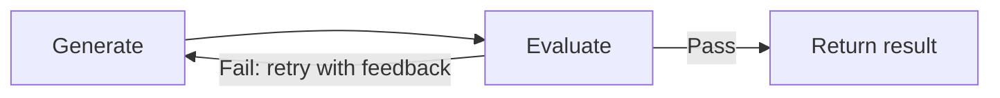

> ## Documentation Index
> Fetch the complete documentation index at: https://docs.restate.dev/llms.txt
> Use this file to discover all available pages before exploring further.

# Evaluation Feedback Loop

> Have an agent generate output, evaluate it with a second LLM call, and loop until quality meets your criteria. Each iteration is checkpointed.

export const GitHubLink = ({url}) => <div style={{
  marginTop: '-8px',
  marginBottom: '8px',
  textAlign: 'right'
}}>
    <a href={url} target="_blank" rel="noopener noreferrer" style={{
  fontSize: '0.75rem',
  color: '#6B7280',
  textDecoration: 'none',
  display: 'inline-flex',
  alignItems: 'center',
  gap: '3px',
  padding: '2px 6px',
  borderRadius: '3px',
  border: '1px solid #E5E7EB',
  backgroundColor: 'transparent',
  transition: 'all 0.2s ease'
}} onMouseOver={e => {
  e.target.style.color = '#6B7280';
  e.target.style.backgroundColor = '#F9FAFB';
}} onMouseOut={e => {
  e.target.style.color = '#6B7280';
  e.target.style.backgroundColor = 'transparent';
}}>
      <svg width="12" height="12" viewBox="0 0 24 24" fill="currentColor">
        <path d="M12 0c-6.626 0-12 5.373-12 12 0 5.302 3.438 9.8 8.207 11.387.599.111.793-.261.793-.577v-2.234c-3.338.726-4.033-1.416-4.033-1.416-.546-1.387-1.333-1.756-1.333-1.756-1.089-.745.083-.729.083-.729 1.205.084 1.839 1.237 1.839 1.237 1.07 1.834 2.807 1.304 3.492.997.107-.775.418-1.305.762-1.604-2.665-.305-5.467-1.334-5.467-5.931 0-1.311.469-2.381 1.236-3.221-.124-.303-.535-1.524.117-3.176 0 0 1.008-.322 3.301 1.23.957-.266 1.983-.399 3.003-.404 1.02.005 2.047.138 3.006.404 2.291-1.552 3.297-1.230 3.297-1.230.653 1.653.242 2.874.118 3.176.77.84 1.235 1.911 1.235 3.221 0 4.609-2.807 5.624-5.479 5.921.43.372.823 1.102.823 2.222v3.293c0 .319.192.694.801.576 4.765-1.589 8.199-6.086 8.199-11.386 0-6.627-5.373-12-12-12z" />
      </svg>
      View on GitHub
    </a>
  </div>;

Have an agent generate output, then evaluate it with a second LLM call and loop until the quality meets your criteria. Restate persists each iteration, so if the process crashes, it resumes from the last completed evaluation without re-running earlier iterations.



## Example: code generation with quality check

A generator agent writes code, then an evaluator agent checks it. If the evaluation fails, the generator retries with the feedback. Each iteration is a durable step.

<Tabs>
  <Tab title="Vercel AI" icon="https://mintcdn.com/restate-6d46e1dc/MqWeXC2P3O-4Bva4/img/languages/typescript.svg?fit=max&auto=format&n=MqWeXC2P3O-4Bva4&q=85&s=62b813088c931e033d6f0c262315f8e8" width="800" height="800" data-path="img/languages/typescript.svg">
    ```typescript workflow-evaluator-optimizer.ts {"CODE_LOAD::https://raw.githubusercontent.com/restatedev/ai-examples/refs/heads/main/vercel-ai/tour-of-agents/src/workflow-evaluator-optimizer.ts#here"}  theme={null}
    const generate = async (ctx: restate.Context, {task}: { task: string }) => {
      const model = wrapLanguageModel({
        model: openai("gpt-5.4"),
        middleware: durableCalls(ctx, { maxRetryAttempts: 3 }),
      });

      let feedback = "";
      const maxIterations = 3;

      for (let i = 0; i < maxIterations; i++) {
        // Step 1: Generate code
        const { text: code } = await generateText({
          model,
          system: "You are a code generator. Write clean, correct code.",
          prompt: feedback
            ? `Task: ${task}\n\nPrevious attempt was rejected:\n${feedback}\n\nPlease fix the issues.`
            : `Task: ${task}`,
        });

        // Step 2: Evaluate the code
        const { text: evaluation } = await generateText({
          model,
          system: `You are a code reviewer. Evaluate the code for correctness,
                readability, and edge cases. Respond with PASS if acceptable,
                or FAIL: <feedback> with specific issues to fix.`,
          prompt: `Task: ${task}\n\nCode:\n${code}`,
        });

        if (evaluation.startsWith("PASS")) {
          return { code, iterations: i + 1 };
        }

        feedback = evaluation;
      }

      return { code: "Max iterations reached", iterations: maxIterations };
    };

    const agent = restate.service({
      name: "CodeGenerator",
      handlers: {
        generate: restate.createServiceHandler(
          { input: schema(CodeGenRequestSchema) },
          generate,
        ),
      },
    });
    ```

    <GitHubLink url="https://github.com/restatedev/ai-examples/blob/main/vercel-ai/tour-of-agents/src/workflow-evaluator-optimizer.ts" />

    <Accordion title="Run this example" icon="laptop">
      [Install Restate](/installation) and launch it:

      ```bash theme={null}
      npm install --global @restatedev/restate-server@latest @restatedev/restate@latest
      restate-server
      ```

      Get the example:

      ```bash theme={null}
      restate example typescript-vercel-ai-tour-of-agents && cd typescript-vercel-ai-tour-of-agents
      npm install
      ```

      Export your [OpenAI API key](https://platform.openai.com/api-keys) and run the agent:

      ```bash theme={null}
      export OPENAI_API_KEY=sk-...
      ```

      ```bash theme={null}
      npx tsx ./src/workflow-evaluator-optimizer.ts
      ```

      Register the agents with Restate:

      ```bash theme={null}
      restate deployments register http://localhost:9080 --force --yes # dev only: overrides previous registrations
      ```

      Sends a request to the agent:

      ```shell theme={null}
      curl localhost:8080/restate/call/CodeGenerator/generate \
      --json '{
          "task": "Write a TypeScript function that implements a retry mechanism with exponential backoff"
      }'
      ```
    </Accordion>
  </Tab>

  <Tab title="OpenAI Agents" icon="https://mintcdn.com/restate-6d46e1dc/MqWeXC2P3O-4Bva4/img/languages/python.svg?fit=max&auto=format&n=MqWeXC2P3O-4Bva4&q=85&s=67a6dbe92867a1d945bbe5940057662e" width="404" height="399" data-path="img/languages/python.svg">
    ```python workflow_evaluator_optimizer.py {"CODE_LOAD::https://raw.githubusercontent.com/restatedev/ai-examples/refs/heads/main/openai-agents/tour-of-agents/app/workflow_evaluator_optimizer.py#here"}  theme={null}
    generator = Agent(
        name="CodeGenerator",
        instructions="You are a code generator. Write clean, correct code.",
    )

    evaluator = Agent(
        name="CodeEvaluator",
        instructions="""You are a code reviewer. Evaluate the code for correctness,
        readability, and edge cases. Respond with PASS if acceptable,
        or FAIL: <feedback> with specific issues to fix.""",
    )

    code_service = restate.Service("CodeGenerator")


    @code_service.handler()
    async def generate(ctx: restate.Context, req: CodeRequest) -> dict:
        feedback = ""
        max_iterations = 3

        for i in range(max_iterations):
            # Step 1: Generate code
            prompt = (
                f"Task: {req.task}\n\nPrevious attempt was rejected:\n{feedback}\n\nPlease fix the issues."
                if feedback
                else f"Task: {req.task}"
            )
            gen_result = await DurableRunner.run(generator, prompt)
            code = gen_result.final_output

            # Step 2: Evaluate the code
            eval_result = await DurableRunner.run(
                evaluator, f"Task: {req.task}\n\nCode:\n{code}"
            )
            evaluation = eval_result.final_output

            if evaluation.startswith("PASS"):
                return {"code": code, "iterations": i + 1}

            feedback = evaluation

        return {"code": "Max iterations reached", "iterations": max_iterations}
    ```

    <GitHubLink url="https://github.com/restatedev/ai-examples/blob/main/openai-agents/tour-of-agents/app/workflow_evaluator_optimizer.py" />

    <Accordion title="Run this example" icon="laptop">
      [Install Restate](/installation) and launch it:

      ```bash theme={null}
      restate-server
      ```

      Get the example:

      ```bash theme={null}
      restate example python-openai-agents-tour-of-agents && cd python-openai-agents-tour-of-agents
      ```

      Export your [OpenAI API key](https://platform.openai.com/api-keys) and run the agent:

      ```bash theme={null}
      export OPENAI_API_KEY=sk-...
      ```

      ```bash theme={null}
      uv run app/workflow_evaluator_optimizer.py
      ```

      Register the agents with Restate:

      ```bash theme={null}
      restate deployments register http://localhost:9080 --force --yes # dev only: overrides previous registrations
      ```

      Send a request:

      ```bash theme={null}
      curl localhost:8080/restate/call/CodeGenerator/generate \
        --json '{"task": "Write a function that checks if a string is a palindrome"}'
      ```
    </Accordion>
  </Tab>

  <Tab title="Google ADK" icon="https://mintcdn.com/restate-6d46e1dc/MqWeXC2P3O-4Bva4/img/languages/python.svg?fit=max&auto=format&n=MqWeXC2P3O-4Bva4&q=85&s=67a6dbe92867a1d945bbe5940057662e" width="404" height="399" data-path="img/languages/python.svg">
    ```python workflow_evaluator_optimizer.py {"CODE_LOAD::https://raw.githubusercontent.com/restatedev/ai-examples/refs/heads/main/google-adk/tour-of-agents/app/workflow_evaluator_optimizer.py#here"}  theme={null}
    # AGENTS
    generator = Agent(
        model="gemini-2.5-flash",
        name="code_generator",
        instruction="You are a code generator. Write clean, correct code.",
    )
    gen_app = App(name=APP_NAME, root_agent=generator, plugins=[RestatePlugin()])
    gen_runner = Runner(app=gen_app, session_service=RestateSessionService())

    evaluator = Agent(
        model="gemini-2.5-flash",
        name="code_evaluator",
        instruction="""You are a code reviewer. Evaluate the code for correctness,
        readability, and edge cases. Respond with PASS if acceptable,
        or FAIL: <feedback> with specific issues to fix.""",
    )
    eval_app = App(name=APP_NAME, root_agent=evaluator, plugins=[RestatePlugin()])
    eval_runner = Runner(app=eval_app, session_service=RestateSessionService())

    # AGENT SERVICE
    code_service = restate.VirtualObject("CodeGenerator")


    @code_service.handler()
    async def generate(ctx: restate.ObjectContext, req: CodeRequest) -> dict:
        feedback = ""
        max_iterations = 3

        for i in range(max_iterations):
            # Step 1: Generate code
            prompt = (
                f"Task: {req.task}\n\nPrevious attempt was rejected:\n{feedback}\n\nPlease fix the issues."
                if feedback
                else f"Task: {req.task}"
            )
            events = gen_runner.run_async(
                user_id=ctx.key(),
                session_id=str(ctx.uuid()),
                new_message=Content(role="user", parts=[Part.from_text(text=prompt)]),
            )
            code = await parse_agent_response(events)

            # Step 2: Evaluate the code
            events = eval_runner.run_async(
                user_id=ctx.key(),
                session_id=str(ctx.uuid()),
                new_message=Content(
                    role="user",
                    parts=[Part.from_text(text=f"Task: {req.task}\n\nCode:\n{code}")],
                ),
            )
            evaluation = await parse_agent_response(events)
            if evaluation.startswith("PASS"):
                return {"code": code, "iterations": i + 1}
            feedback = evaluation

        return {"code": "Max iterations reached", "iterations": max_iterations}
    ```

    <GitHubLink url="https://github.com/restatedev/ai-examples/blob/main/google-adk/tour-of-agents/app/workflow_evaluator_optimizer.py" />

    <Accordion title="Run this example" icon="laptop">
      [Install Restate](/installation) and launch it:

      ```bash theme={null}
      restate-server
      ```

      Get the example:

      ```bash theme={null}
      restate example python-google-adk-tour-of-agents && cd python-google-adk-tour-of-agents
      ```

      Export your [Google API key](https://aistudio.google.com/app/apikey) and run the agent:

      ```bash theme={null}
      export GOOGLE_API_KEY=your-api-key
      ```

      ```bash theme={null}
      uv run app/workflow_evaluator_optimizer.py
      ```

      Register the agents with Restate:

      ```bash theme={null}
      restate deployments register http://localhost:9080 --force --yes # dev only: overrides previous registrations
      ```

      Send a request:

      ```bash theme={null}
      curl localhost:8080/restate/call/CodeGenerator/user123/generate \
        --json '{"task": "Write a function that checks if a string is a palindrome"}'
      ```
    </Accordion>
  </Tab>

  <Tab title="Pydantic AI" icon="https://mintcdn.com/restate-6d46e1dc/MqWeXC2P3O-4Bva4/img/languages/python.svg?fit=max&auto=format&n=MqWeXC2P3O-4Bva4&q=85&s=67a6dbe92867a1d945bbe5940057662e" width="404" height="399" data-path="img/languages/python.svg">
    ```python workflow_evaluator_optimizer.py {"CODE_LOAD::https://raw.githubusercontent.com/restatedev/ai-examples/refs/heads/main/pydantic-ai/tour-of-agents/app/workflow_evaluator_optimizer.py#here"}  theme={null}
    generator = Agent(
        "openai:gpt-5.4",
        system_prompt="You are a code generator. Write clean, correct code.",
    )
    restate_generator = RestateAgent(generator)

    evaluator = Agent(
        "openai:gpt-5.4",
        system_prompt="""You are a code reviewer. Evaluate the code for correctness,
        readability, and edge cases. Respond with PASS if acceptable,
        or FAIL: <feedback> with specific issues to fix.""",
    )
    restate_evaluator = RestateAgent(evaluator)

    code_service = restate.Service("CodeGenerator")


    @code_service.handler()
    async def generate(_ctx: restate.Context, req: CodeRequest) -> dict:
        feedback = ""
        max_iterations = 3

        for i in range(max_iterations):
            # Step 1: Generate code
            prompt = (
                f"Task: {req.task}\n\nPrevious attempt was rejected:\n{feedback}\n\nPlease fix the issues."
                if feedback
                else f"Task: {req.task}"
            )
            gen_result = await restate_generator.run(prompt)
            code = gen_result.output

            # Step 2: Evaluate the code
            eval_result = await restate_evaluator.run(f"Task: {req.task}\n\nCode:\n{code}")
            evaluation = eval_result.output

            if evaluation.startswith("PASS"):
                return {"code": code, "iterations": i + 1}

            feedback = evaluation

        return {"code": "Max iterations reached", "iterations": max_iterations}
    ```

    <GitHubLink url="https://github.com/restatedev/ai-examples/blob/main/pydantic-ai/tour-of-agents/app/workflow_evaluator_optimizer.py" />

    <Accordion title="Run this example" icon="laptop">
      [Install Restate](/installation) and launch it:

      ```bash theme={null}
      restate-server
      ```

      Get the example:

      ```bash theme={null}
      restate example python-pydantic-ai-tour-of-agents && cd python-pydantic-ai-tour-of-agents
      ```

      Export your [OpenAI API key](https://platform.openai.com/api-keys) and run the agent:

      ```bash theme={null}
      export OPENAI_API_KEY=sk-...
      ```

      ```bash theme={null}
      uv run app/workflow_evaluator_optimizer.py
      ```

      Register the agents with Restate:

      ```bash theme={null}
      restate deployments register http://localhost:9080 --force --yes # dev only: overrides previous registrations
      ```

      Send a request:

      ```bash theme={null}
      curl localhost:8080/restate/call/CodeGenerator/generate \
        --json '{"task": "Write a function that checks if a string is a palindrome"}'
      ```
    </Accordion>
  </Tab>

  <Tab title="LangChain" icon="https://mintcdn.com/restate-6d46e1dc/MqWeXC2P3O-4Bva4/img/languages/python.svg?fit=max&auto=format&n=MqWeXC2P3O-4Bva4&q=85&s=67a6dbe92867a1d945bbe5940057662e" width="404" height="399" data-path="img/languages/python.svg">
    ```python workflow_evaluator_optimizer.py {"CODE_LOAD::https://raw.githubusercontent.com/restatedev/ai-examples/refs/heads/main/langchain-python/tour-of-agents/app/workflow_evaluator_optimizer.py#here"}  theme={null}
    generator = create_agent(
        model=init_chat_model("openai:gpt-5.4"),
        system_prompt="You are a code generator. Write clean, correct code.",
        middleware=[RestateMiddleware()],
    )

    evaluator = create_agent(
        model=init_chat_model("openai:gpt-5.4"),
        system_prompt=(
            "You are a code reviewer. Evaluate the code for correctness, "
            "readability, and edge cases. Respond with PASS if acceptable, or "
            "FAIL: <feedback> with specific issues to fix."
        ),
        middleware=[RestateMiddleware()],
    )

    code_service = restate.Service("CodeGenerator")


    @code_service.handler()
    async def generate(_ctx: restate.Context, req: CodeRequest) -> dict:
        feedback = ""
        max_iterations = 3

        for i in range(max_iterations):
            # Step 1: Generate code
            prompt = (
                f"Task: {req.task}\n\nPrevious attempt was rejected:\n{feedback}\n\nPlease fix the issues."
                if feedback
                else f"Task: {req.task}"
            )
            gen_result = await generator.ainvoke({"messages": prompt})
            code = gen_result["messages"][-1].content

            # Step 2: Evaluate the code
            eval_result = await evaluator.ainvoke(
                {"messages": f"Task: {req.task}\n\nCode:\n{code}"}
            )
            evaluation = eval_result["messages"][-1].content

            if evaluation.startswith("PASS"):
                return {"code": code, "iterations": i + 1}

            feedback = evaluation

        return {"code": "Max iterations reached", "iterations": max_iterations}
    ```

    <GitHubLink url="https://github.com/restatedev/ai-examples/blob/main/langchain-python/tour-of-agents/app/workflow_evaluator_optimizer.py" />

    <Accordion title="Run this example" icon="laptop">
      [Install Restate](/installation) and launch it:

      ```bash theme={null}
      restate-server
      ```

      Get the example:

      ```bash theme={null}
      restate example python-langchain-tour-of-agents && cd python-langchain-tour-of-agents
      ```

      Export your [OpenAI API key](https://platform.openai.com/api-keys) and run the agent:

      ```bash theme={null}
      export OPENAI_API_KEY=sk-...
      ```

      ```bash theme={null}
      uv run app/workflow_evaluator_optimizer.py
      ```

      Register the agents with Restate:

      ```bash theme={null}
      restate deployments register http://localhost:9080 --force --yes # dev only: overrides previous registrations
      ```

      Send a request:

      ```bash theme={null}
      curl localhost:8080/restate/call/CodeGenerator/generate \
        --json '{"task": "Write a function that checks if a string is a palindrome"}'
      ```
    </Accordion>
  </Tab>

  <Tab title="Restate TS" icon="https://mintcdn.com/restate-6d46e1dc/MqWeXC2P3O-4Bva4/img/languages/typescript.svg?fit=max&auto=format&n=MqWeXC2P3O-4Bva4&q=85&s=62b813088c931e033d6f0c262315f8e8" width="800" height="800" data-path="img/languages/typescript.svg">
    ```typescript workflow-evaluator-optimizer.ts {"CODE_LOAD::https://raw.githubusercontent.com/restatedev/ai-examples/refs/heads/main/typescript-restate-only/tour-of-agents/src/workflow-evaluator-optimizer.ts#here"}  theme={null}
    const generate = async (ctx: restate.Context, {task}: { task: string }) => {
        let feedback = "";
        const maxIterations = 3;

        for (let i = 0; i < maxIterations; i++) {
          // Step 1: Generate code
          const code = await ctx.run(
            `Generate code (attempt ${i + 1})`,
            async () =>
              llmCall(
                feedback
                  ? `You are a code generator. Write clean, correct code.\n\nTask: ${task}\n\nPrevious attempt was rejected:\n${feedback}\n\nPlease fix the issues.`
                  : `You are a code generator. Write clean, correct code.\n\nTask: ${task}`,
              ),
            { maxRetryAttempts: 3 },
          );

          // Step 2: Evaluate the code
          const evaluation = await ctx.run(
            `Evaluate code (attempt ${i + 1})`,
            async () =>
              llmCall(
                `You are a code reviewer. Evaluate the code for correctness,
                readability, and edge cases. Respond with PASS if acceptable,
                or FAIL: <feedback> with specific issues to fix.\n\nTask: ${task}\n\nCode:\n${code.text}`,
              ),
            { maxRetryAttempts: 3 },
          );

          if (evaluation.text.startsWith("PASS")) {
            return { code: code.text, iterations: i + 1 };
          }

          feedback = evaluation.text;
        }

        return { code: "Max iterations reached", iterations: maxIterations };
    };

    const agent = restate.service({
      name: "CodeGenerator",
      handlers: {
        generate: restate.createServiceHandler(
            { input: schema(CodeGenRequestSchema) },
            generate,
        ),
      },
    });
    ```

    <GitHubLink url="https://github.com/restatedev/ai-examples/blob/main/typescript-restate-only/tour-of-agents/src/workflow-evaluator-optimizer.ts" />

    <Accordion title="Run this example" icon="laptop">
      [Install Restate](/installation) and launch it:

      ```bash theme={null}
      restate-server
      ```

      Get the example:

      ```bash theme={null}
      restate example typescript-restate-tour-of-agents && cd typescript-restate-tour-of-agents
      npm install
      ```

      Export your API key:

      ```bash theme={null}
      export OPENAI_API_KEY=sk-...
      ```

      ```bash theme={null}
      npx tsx ./src/workflow-evaluator-optimizer.ts
      ```

      Register the services with Restate:

      ```bash theme={null}
      restate deployments register http://localhost:9080 --force --yes # dev only: overrides previous registrations
      ```

      Send a request:

      ```bash theme={null}
      curl localhost:8080/restate/call/CodeGenerator/generate \
        --json '{"task": "Write a function that checks if a string is a palindrome"}'
      ```
    </Accordion>
  </Tab>

  <Tab title="Restate Py" icon="https://mintcdn.com/restate-6d46e1dc/MqWeXC2P3O-4Bva4/img/languages/python.svg?fit=max&auto=format&n=MqWeXC2P3O-4Bva4&q=85&s=67a6dbe92867a1d945bbe5940057662e" width="404" height="399" data-path="img/languages/python.svg">
    ```python workflow_evaluator_optimizer.py {"CODE_LOAD::https://raw.githubusercontent.com/restatedev/ai-examples/refs/heads/main/python-restate-only/tour-of-agents/app/workflow_evaluator_optimizer.py#here"}  theme={null}
    code_service = restate.Service("CodeGenerator")


    @code_service.handler()
    async def generate(ctx: restate.Context, req: CodeRequest) -> dict:
        feedback = ""
        max_iterations = 3

        for i in range(max_iterations):
            # Step 1: Generate code
            prompt = (
                f"Task: {req.task}\n\nPrevious attempt was rejected:\n{feedback}\n\nPlease fix the issues."
                if feedback
                else f"Task: {req.task}"
            )
            code = await ctx.run_typed(
                f"Generate code (attempt {i + 1})",
                llm_call,
                RunOptions(max_attempts=3),
                messages=f"You are a code generator. Write clean, correct code. {prompt}",
            )

            # Step 2: Evaluate the code
            evaluation = await ctx.run_typed(
                f"Evaluate code (attempt {i + 1})",
                llm_call,
                RunOptions(max_attempts=3),
                messages=f"""You are a code reviewer. Evaluate the code for correctness,
                readability, and edge cases. Respond with PASS if acceptable,
                or FAIL: <feedback> with specific issues to fix.
                Task: {req.task}\n\nCode:\n{code.content}""",
            )

            if evaluation.content and evaluation.content.startswith("PASS"):
                return {"code": code.content, "iterations": i + 1}

            feedback = evaluation.content or ""

        return {"code": "Max iterations reached", "iterations": max_iterations}
    ```

    <GitHubLink url="https://github.com/restatedev/ai-examples/blob/main/python-restate-only/tour-of-agents/app/workflow_evaluator_optimizer.py" />

    <Accordion title="Run this example" icon="laptop">
      [Install Restate](/installation) and launch it:

      ```bash theme={null}
      restate-server
      ```

      Get the example:

      ```bash theme={null}
      restate example python-restate-tour-of-agents && cd python-restate-tour-of-agents
      ```

      Export your API key:

      ```bash theme={null}
      export OPENAI_API_KEY=sk-...
      ```

      ```bash theme={null}
      uv run app/workflow_evaluator_optimizer.py
      ```

      Register the services with Restate:

      ```bash theme={null}
      restate deployments register http://localhost:9080 --force --yes # dev only: overrides previous registrations
      ```

      Send a request:

      ```bash theme={null}
      curl localhost:8080/restate/call/CodeGenerator/generate \
        --json '{"task": "Write a function that checks if a string is a palindrome"}'
      ```
    </Accordion>
  </Tab>
</Tabs>

Each generate and evaluate call is persisted in the journal. If the process crashes after a successful generation but before evaluation, the generated code is replayed from the journal without calling the LLM again.
