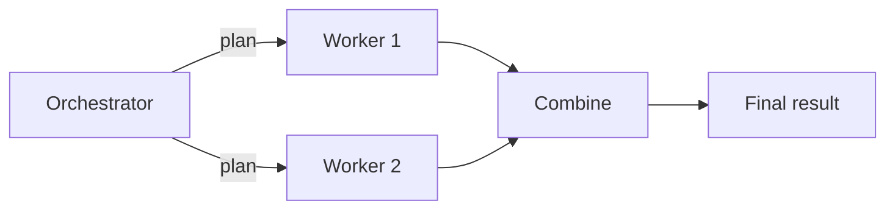

> ## Documentation Index
> Fetch the complete documentation index at: https://docs.restate.dev/llms.txt
> Use this file to discover all available pages before exploring further.

# Orchestrator-Worker

> An orchestrator agent dynamically plans tasks and dispatches them to worker agents. Plans and results are durably persisted.

export const GitHubLink = ({url}) => <div style={{
  marginTop: '-8px',
  marginBottom: '8px',
  textAlign: 'right'
}}>
    <a href={url} target="_blank" rel="noopener noreferrer" style={{
  fontSize: '0.75rem',
  color: '#6B7280',
  textDecoration: 'none',
  display: 'inline-flex',
  alignItems: 'center',
  gap: '3px',
  padding: '2px 6px',
  borderRadius: '3px',
  border: '1px solid #E5E7EB',
  backgroundColor: 'transparent',
  transition: 'all 0.2s ease'
}} onMouseOver={e => {
  e.target.style.color = '#6B7280';
  e.target.style.backgroundColor = '#F9FAFB';
}} onMouseOut={e => {
  e.target.style.color = '#6B7280';
  e.target.style.backgroundColor = 'transparent';
}}>
      <svg width="12" height="12" viewBox="0 0 24 24" fill="currentColor">
        <path d="M12 0c-6.626 0-12 5.373-12 12 0 5.302 3.438 9.8 8.207 11.387.599.111.793-.261.793-.577v-2.234c-3.338.726-4.033-1.416-4.033-1.416-.546-1.387-1.333-1.756-1.333-1.756-1.089-.745.083-.729.083-.729 1.205.084 1.839 1.237 1.839 1.237 1.07 1.834 2.807 1.304 3.492.997.107-.775.418-1.305.762-1.604-2.665-.305-5.467-1.334-5.467-5.931 0-1.311.469-2.381 1.236-3.221-.124-.303-.535-1.524.117-3.176 0 0 1.008-.322 3.301 1.23.957-.266 1.983-.399 3.003-.404 1.02.005 2.047.138 3.006.404 2.291-1.552 3.297-1.230 3.297-1.230.653 1.653.242 2.874.118 3.176.77.84 1.235 1.911 1.235 3.221 0 4.609-2.807 5.624-5.479 5.921.43.372.823 1.102.823 2.222v3.293c0 .319.192.694.801.576 4.765-1.589 8.199-6.086 8.199-11.386 0-6.627-5.373-12-12-12z" />
      </svg>
      View on GitHub
    </a>
  </div>;

An orchestrator agent dynamically decides what tasks to dispatch, and worker agents execute them. The orchestrator can plan, delegate, and combine results in any order. Restate ensures the orchestrator's plan and each worker's result are durably persisted.



## Example: research report generation

An orchestrator agent breaks a research topic into sub-tasks, dispatches them to worker agents, and combines the results into a report.

<Tabs>
  <Tab title="Vercel AI" icon="https://mintcdn.com/restate-6d46e1dc/MqWeXC2P3O-4Bva4/img/languages/typescript.svg?fit=max&auto=format&n=MqWeXC2P3O-4Bva4&q=85&s=62b813088c931e033d6f0c262315f8e8" width="800" height="800" data-path="img/languages/typescript.svg">
    ```typescript workflow-orchestrator.ts {"CODE_LOAD::https://raw.githubusercontent.com/restatedev/ai-examples/refs/heads/main/vercel-ai/tour-of-agents/src/workflow-orchestrator.ts#here"}  theme={null}
    export const researchWorker = restate.service({
      name: "ResearchWorker",
      handlers: {
        research: async (ctx: restate.Context, {question}: { question: string }) => {
          const model = wrapLanguageModel({
            model: openai("gpt-5.4"),
            middleware: durableCalls(ctx, { maxRetryAttempts: 3 }),
          });
          const { text: answer } = await generateText({
            model,
            system:
              "You are a research assistant. Provide a concise, factual answer.",
            prompt: question,
          });
          return { question, answer };
        },
      },
    });

    const orchestrator = restate.service({
      name: "ResearchReport",
      handlers: {
        generate: restate.createServiceHandler(
          { input: schema(ResearchRequestSchema) },
          async (ctx: restate.Context, {topic}: { topic: string }) => {
            const model = wrapLanguageModel({
              model: openai("gpt-5.4"),
              middleware: durableCalls(ctx, { maxRetryAttempts: 3 }),
            });

            // Step 1: Orchestrator creates a research plan
            const { output: tasks } = await generateText({
              model,
              system: `You are a research planner. Break the topic into 2-4 research
              sub-tasks. Respond with a JSON array of strings, each a specific
              research question. Example: ["question 1", "question 2"]`,
              prompt: topic,
              output: Output.array({element: z.string()})
            });

            // Step 2: Dispatch workers in parallel
            const workerResults = await RestatePromise.all(
              tasks.map((question) =>
                ctx.serviceClient(researchWorker).research({ question }),
              ),
            );

            // Step 3: Combine results into a report
            const { text: report } = await generateText({
              model,
              system:
                "You are a report writer. Combine the research findings into a cohesive report.",
              prompt: `Topic: ${topic}\n\nResearch findings:\n${JSON.stringify(workerResults)}`,
            });

            return { report, taskCount: tasks.length };
          },
        ),
      },
    });
    ```

    <GitHubLink url="https://github.com/restatedev/ai-examples/blob/main/vercel-ai/tour-of-agents/src/workflow-orchestrator.ts" />

    <Accordion title="Run this example" icon="laptop">
      [Install Restate](/installation) and launch it:

      ```bash theme={null}
      npm install --global @restatedev/restate-server@latest @restatedev/restate@latest
      restate-server
      ```

      Get the example:

      ```bash theme={null}
      restate example typescript-vercel-ai-tour-of-agents && cd typescript-vercel-ai-tour-of-agents
      npm install
      ```

      Export your [OpenAI API key](https://platform.openai.com/api-keys) and run the agent:

      ```bash theme={null}
      export OPENAI_API_KEY=sk-...
      ```

      ```bash theme={null}
      npx tsx ./src/workflow-orchestrator.ts
      ```

      Register the agents with Restate:

      ```bash theme={null}
      restate deployments register http://localhost:9080 --force --yes # dev only: overrides previous registrations
      ```

      Send a request to the agent:

      ```shell theme={null}
      curl localhost:8080/restate/call/ResearchReport/generate \
      --json '{
          "topic": "Benefits of durable execution in distributed systems"
      }'
      ```
    </Accordion>
  </Tab>

  <Tab title="OpenAI Agents" icon="https://mintcdn.com/restate-6d46e1dc/MqWeXC2P3O-4Bva4/img/languages/python.svg?fit=max&auto=format&n=MqWeXC2P3O-4Bva4&q=85&s=67a6dbe92867a1d945bbe5940057662e" width="404" height="399" data-path="img/languages/python.svg">
    ```python workflow_orchestrator.py {"CODE_LOAD::https://raw.githubusercontent.com/restatedev/ai-examples/refs/heads/main/openai-agents/tour-of-agents/app/workflow_orchestrator.py#here"}  theme={null}
    planner = Agent(
        name="ResearchPlanner",
        instructions="You are a research planner. Break the topic into 2-4 research sub-tasks.",
        output_type=TaskList,
    )

    researcher = Agent(
        name="Researcher",
        instructions="You are a research assistant. Provide a concise, factual answer.",
    )

    writer = Agent(
        name="ReportWriter",
        instructions="You are a report writer. Combine the research findings into a cohesive report.",
    )

    report_service = restate.Service("ResearchReport")


    @report_service.handler()
    async def generate(ctx: restate.Context, req: ReportRequest) -> dict:
        # Step 1: Orchestrator creates a research plan
        plan_result = await DurableRunner.run(planner, req.topic)
        tasks = plan_result.final_output.tasks

        # Step 2: Dispatch workers in parallel
        worker_promises = []
        for task in tasks:
            promise = ctx.service_call(run_researcher, task)
            worker_promises.append(promise)

        await restate.gather(*worker_promises)
        findings = [await p for p in worker_promises]

        # Step 3: Combine results into a report
        report_result = await DurableRunner.run(
            writer,
            f"Topic: {req.topic}\n\nResearch findings:\n{json.dumps(findings, indent=2)}",
        )

        return {"report": report_result.final_output, "task_count": len(tasks)}


    researcher_service = restate.Service("Researcher")


    @researcher_service.handler()
    async def run_researcher(ctx: restate.Context, task: ResearchTask) -> str:
        result = await DurableRunner.run(researcher, task.question)
        return result.final_output
    ```

    <GitHubLink url="https://github.com/restatedev/ai-examples/blob/main/openai-agents/tour-of-agents/app/workflow_orchestrator.py" />

    <Accordion title="Run this example" icon="laptop">
      [Install Restate](/installation) and launch it:

      ```bash theme={null}
      restate-server
      ```

      Get the example:

      ```bash theme={null}
      restate example python-openai-agents-tour-of-agents && cd python-openai-agents-tour-of-agents
      ```

      Export your [OpenAI API key](https://platform.openai.com/api-keys) and run the agent:

      ```bash theme={null}
      export OPENAI_API_KEY=sk-...
      ```

      ```bash theme={null}
      uv run app/workflow_orchestrator.py
      ```

      Register the agents with Restate:

      ```bash theme={null}
      restate deployments register http://localhost:9080 --force --yes # dev only: overrides previous registrations
      ```

      Send a request:

      ```bash theme={null}
      curl localhost:8080/restate/call/ResearchReport/generate \
        --json '{"topic": "The impact of renewable energy on global economies"}'
      ```
    </Accordion>
  </Tab>

  <Tab title="Google ADK" icon="https://mintcdn.com/restate-6d46e1dc/MqWeXC2P3O-4Bva4/img/languages/python.svg?fit=max&auto=format&n=MqWeXC2P3O-4Bva4&q=85&s=67a6dbe92867a1d945bbe5940057662e" width="404" height="399" data-path="img/languages/python.svg">
    ```python workflow_orchestrator.py {"CODE_LOAD::https://raw.githubusercontent.com/restatedev/ai-examples/refs/heads/main/google-adk/tour-of-agents/app/workflow_orchestrator.py#here"}  theme={null}
    report_service = restate.VirtualObject("ResearchReport")


    @report_service.handler()
    async def generate(ctx: restate.ObjectContext, req: ReportRequest) -> dict:
        session_id = str(ctx.uuid())
        # Step 1: Orchestrator creates a research plan
        plan_events = plan_runner.run_async(
            user_id=ctx.key(),
            session_id=session_id,
            new_message=Content(role="user", parts=[Part.from_text(text=req.topic)]),
        )
        plan_output = await parse_agent_response(plan_events)
        tasks = TaskList.model_validate_json(plan_output).tasks

        # Step 2: Dispatch workers in parallel
        worker_promises = []
        for task in tasks:
            promise = ctx.object_call(run_researcher, key=str(ctx.uuid()), arg=task)
            worker_promises.append(promise)

        await restate.gather(*worker_promises)
        findings = [await p for p in worker_promises]

        # Step 3: Combine results into a report
        results = f"Topic: {req.topic}\n\nResearch findings:\n{json.dumps(findings)}"
        events = writer_runner.run_async(
            user_id=ctx.key(),
            session_id=session_id,
            new_message=Content(role="user", parts=[Part.from_text(text=results)]),
        )
        report = await parse_agent_response(events)

        return {"report": report, "task_count": len(tasks)}


    researcher_service = restate.VirtualObject("Researcher")


    @researcher_service.handler()
    async def run_researcher(ctx: restate.ObjectContext, task: ResearchTask) -> str:
        events = research_runner.run_async(
            user_id=ctx.key(),
            session_id=str(ctx.uuid()),
            new_message=Content(role="user", parts=[Part.from_text(text=task.question)]),
        )
        return await parse_agent_response(events)
    ```

    <GitHubLink url="https://github.com/restatedev/ai-examples/blob/main/google-adk/tour-of-agents/app/workflow_orchestrator.py" />

    <Accordion title="Run this example" icon="laptop">
      [Install Restate](/installation) and launch it:

      ```bash theme={null}
      restate-server
      ```

      Get the example:

      ```bash theme={null}
      restate example python-google-adk-tour-of-agents && cd python-google-adk-tour-of-agents
      ```

      Export your [Google API key](https://aistudio.google.com/app/apikey) and run the agent:

      ```bash theme={null}
      export GOOGLE_API_KEY=your-api-key
      ```

      ```bash theme={null}
      uv run app/workflow_orchestrator.py
      ```

      Register the agents with Restate:

      ```bash theme={null}
      restate deployments register http://localhost:9080 --force --yes # dev only: overrides previous registrations
      ```

      Send a request:

      ```bash theme={null}
      curl localhost:8080/restate/call/ResearchReport/user123/generate \
        --json '{
          "sessionId": "session-123",
          "topic": "The impact of renewable energy on global economies"
        }'
      ```
    </Accordion>
  </Tab>

  <Tab title="Pydantic AI" icon="https://mintcdn.com/restate-6d46e1dc/MqWeXC2P3O-4Bva4/img/languages/python.svg?fit=max&auto=format&n=MqWeXC2P3O-4Bva4&q=85&s=67a6dbe92867a1d945bbe5940057662e" width="404" height="399" data-path="img/languages/python.svg">
    ```python workflow_orchestrator.py {"CODE_LOAD::https://raw.githubusercontent.com/restatedev/ai-examples/refs/heads/main/pydantic-ai/tour-of-agents/app/workflow_orchestrator.py#here"}  theme={null}
    planner = Agent(
        "openai:gpt-5.4",
        system_prompt="You are a research planner. Break the topic into 2-4 research sub-tasks.",
        output_type=TaskList,
    )
    restate_planner = RestateAgent(planner)

    researcher = Agent(
        "openai:gpt-5.4",
        system_prompt="You are a research assistant. Provide a concise, factual answer.",
    )
    restate_researcher = RestateAgent(researcher)

    writer = Agent(
        "openai:gpt-5.4",
        system_prompt="You are a report writer. Combine the research findings into a cohesive report.",
    )
    restate_writer = RestateAgent(writer)

    report_service = restate.Service("ResearchReport")


    @report_service.handler()
    async def generate(ctx: restate.Context, req: ReportRequest) -> dict:
        # Step 1: Orchestrator creates a research plan
        plan_result = await restate_planner.run(req.topic)
        tasks = plan_result.output.tasks

        # Step 2: Dispatch workers in parallel
        worker_promises = []
        for task in tasks:
            promise = ctx.service_call(run_researcher, task)
            worker_promises.append(promise)

        await restate.gather(*worker_promises)
        findings = [await p for p in worker_promises]

        # Step 3: Combine results into a report
        report_result = await restate_writer.run(
            f"Topic: {req.topic}\n\nResearch findings:\n{json.dumps(findings)}",
        )

        return {"report": report_result.output, "task_count": len(tasks)}


    researcher_service = restate.Service("Researcher")


    @researcher_service.handler()
    async def run_researcher(_ctx: restate.Context, task: ResearchTask) -> str:
        result = await restate_researcher.run(task.question)
        return result.output
    ```

    <GitHubLink url="https://github.com/restatedev/ai-examples/blob/main/pydantic-ai/tour-of-agents/app/workflow_orchestrator.py" />

    <Accordion title="Run this example" icon="laptop">
      [Install Restate](/installation) and launch it:

      ```bash theme={null}
      restate-server
      ```

      Get the example:

      ```bash theme={null}
      restate example python-pydantic-ai-tour-of-agents && cd python-pydantic-ai-tour-of-agents
      ```

      Export your [OpenAI API key](https://platform.openai.com/api-keys) and run the agent:

      ```bash theme={null}
      export OPENAI_API_KEY=sk-...
      ```

      ```bash theme={null}
      uv run app/workflow_orchestrator.py
      ```

      Register the agents with Restate:

      ```bash theme={null}
      restate deployments register http://localhost:9080 --force --yes # dev only: overrides previous registrations
      ```

      Send a request:

      ```bash theme={null}
      curl localhost:8080/restate/call/ResearchReport/generate \
        --json '{"topic": "The impact of renewable energy on global economies"}'
      ```
    </Accordion>
  </Tab>

  <Tab title="LangChain" icon="https://mintcdn.com/restate-6d46e1dc/MqWeXC2P3O-4Bva4/img/languages/python.svg?fit=max&auto=format&n=MqWeXC2P3O-4Bva4&q=85&s=67a6dbe92867a1d945bbe5940057662e" width="404" height="399" data-path="img/languages/python.svg">
    ```python workflow_orchestrator.py {"CODE_LOAD::https://raw.githubusercontent.com/restatedev/ai-examples/refs/heads/main/langchain-python/tour-of-agents/app/workflow_orchestrator.py#here"}  theme={null}
    planner = create_agent(
        model=init_chat_model("openai:gpt-5.4"),
        system_prompt="You are a research planner. Break the topic into 2-4 research sub-tasks.",
        response_format=TaskList,
        middleware=[RestateMiddleware()],
    )

    researcher = create_agent(
        model=init_chat_model("openai:gpt-5.4"),
        system_prompt="You are a research assistant. Provide a concise, factual answer.",
        middleware=[RestateMiddleware()],
    )

    writer = create_agent(
        model=init_chat_model("openai:gpt-5.4"),
        system_prompt="You are a report writer. Combine the research findings into a cohesive report.",
        middleware=[RestateMiddleware()],
    )

    report_service = restate.Service("ResearchReport")


    @report_service.handler()
    async def generate(ctx: restate.Context, req: ReportRequest) -> dict:
        # Step 1: Orchestrator creates a research plan.
        plan_result = await planner.ainvoke({"messages": req.topic})
        tasks: list[ResearchTask] = plan_result["structured_response"].tasks

        # Step 2: Dispatch researchers in parallel.
        worker_promises = [ctx.service_call(run_researcher, task) for task in tasks]
        await restate.gather(*worker_promises)
        findings = [await p for p in worker_promises]

        # Step 3: Combine into a report.
        message = f"Topic: {req.topic}\n\nResearch findings:\n{json.dumps(findings)}"
        report_result = await writer.ainvoke({"messages": message})

        return {"report": report_result["messages"][-1].content, "task_count": len(tasks)}


    researcher_service = restate.Service("Researcher")


    @researcher_service.handler()
    async def run_researcher(_ctx: restate.Context, task: ResearchTask) -> str:
        result = await researcher.ainvoke({"messages": task.question})
        return result["messages"][-1].content
    ```

    <GitHubLink url="https://github.com/restatedev/ai-examples/blob/main/langchain-python/tour-of-agents/app/workflow_orchestrator.py" />

    <Accordion title="Run this example" icon="laptop">
      [Install Restate](/installation) and launch it:

      ```bash theme={null}
      restate-server
      ```

      Get the example:

      ```bash theme={null}
      restate example python-langchain-tour-of-agents && cd python-langchain-tour-of-agents
      ```

      Export your [OpenAI API key](https://platform.openai.com/api-keys) and run the agent:

      ```bash theme={null}
      export OPENAI_API_KEY=sk-...
      ```

      ```bash theme={null}
      uv run app/workflow_orchestrator.py
      ```

      Register the agents with Restate:

      ```bash theme={null}
      restate deployments register http://localhost:9080 --force --yes # dev only: overrides previous registrations
      ```

      Send a request:

      ```bash theme={null}
      curl localhost:8080/restate/call/ResearchReport/generate \
        --json '{"topic": "The impact of renewable energy on global economies"}'
      ```
    </Accordion>
  </Tab>

  <Tab title="Restate TS" icon="https://mintcdn.com/restate-6d46e1dc/MqWeXC2P3O-4Bva4/img/languages/typescript.svg?fit=max&auto=format&n=MqWeXC2P3O-4Bva4&q=85&s=62b813088c931e033d6f0c262315f8e8" width="800" height="800" data-path="img/languages/typescript.svg">
    ```typescript workflow-orchestrator.ts {"CODE_LOAD::https://raw.githubusercontent.com/restatedev/ai-examples/refs/heads/main/typescript-restate-only/tour-of-agents/src/workflow-orchestrator.ts#here"}  theme={null}
    export const researchWorker = restate.service({
      name: "ResearchWorker",
      handlers: {
        research: async (ctx: restate.Context, req: { question: string }) => {
          const answer = await ctx.run(
            "Research",
            async () =>
              llmCall(
                `You are a research assistant. Provide a concise, factual answer.\n\n${req.question}`,
              ),
            { maxRetryAttempts: 3 },
          );
          return { question: req.question, answer: answer.text };
        },
      },
    });

    const orchestrator = restate.service({
      name: "ResearchReport",
      handlers: {
        generate: restate.createServiceHandler(
            { input: schema(ResearchRequestSchema) },
            async (ctx: restate.Context, {topic}: { topic: string }) => {
          // Step 1: Orchestrator creates a research plan
          const planJson = await ctx.run(
            "Create research plan",
            async () =>
              llmCall(
                `You are a research planner. Break the topic into 2-4 research
              sub-tasks. Respond with a JSON array of strings, each a specific
              research question. Example: ["question 1", "question 2"]\n\nTopic: ${topic}`,
              ),
            { maxRetryAttempts: 3 },
          );
          const tasks: string[] = JSON.parse(planJson.text);

          // Step 2: Dispatch workers in parallel
          const workerResults = await RestatePromise.all(
            tasks.map((question) =>
              ctx.serviceClient(researchWorker).research({ question }),
            ),
          );

          // Step 3: Combine results into a report
          const report = await ctx.run(
            "Write report",
            async () =>
              llmCall(
                `You are a report writer. Combine the research findings into a cohesive report.\n\n
                Topic: ${topic}\n\nResearch findings:\n${JSON.stringify(workerResults)}`,
              ),
            { maxRetryAttempts: 3 },
          );

          return { report: report.text, taskCount: tasks.length };
            },
        ),
      },
    });
    ```

    <GitHubLink url="https://github.com/restatedev/ai-examples/blob/main/typescript-restate-only/tour-of-agents/src/workflow-orchestrator.ts" />

    <Accordion title="Run this example" icon="laptop">
      [Install Restate](/installation) and launch it:

      ```bash theme={null}
      restate-server
      ```

      Get the example:

      ```bash theme={null}
      restate example typescript-restate-tour-of-agents && cd typescript-restate-tour-of-agents
      npm install
      ```

      Export your API key:

      ```bash theme={null}
      export OPENAI_API_KEY=sk-...
      ```

      ```bash theme={null}
      npx tsx ./src/workflow-orchestrator.ts
      ```

      Register the services with Restate:

      ```bash theme={null}
      restate deployments register http://localhost:9080 --force --yes # dev only: overrides previous registrations
      ```

      Send a request:

      ```bash theme={null}
      curl localhost:8080/restate/call/ResearchReport/generate \
        --json '{"topic": "The impact of renewable energy on global economies"}'
      ```
    </Accordion>
  </Tab>

  <Tab title="Restate Py" icon="https://mintcdn.com/restate-6d46e1dc/MqWeXC2P3O-4Bva4/img/languages/python.svg?fit=max&auto=format&n=MqWeXC2P3O-4Bva4&q=85&s=67a6dbe92867a1d945bbe5940057662e" width="404" height="399" data-path="img/languages/python.svg">
    ```python workflow_orchestrator.py {"CODE_LOAD::https://raw.githubusercontent.com/restatedev/ai-examples/refs/heads/main/python-restate-only/tour-of-agents/app/workflow_orchestrator.py#here"}  theme={null}
    researcher_service = restate.Service("ResearchWorker")


    @researcher_service.handler()
    async def research(ctx: restate.Context, req: ResearchTask) -> dict:
        answer = await ctx.run_typed(
            "Research",
            llm_call,
            RunOptions(max_attempts=3),
            messages=f"You are a research assistant. Provide a concise, factual answer. {req.question}",
        )
        return {"question": req.question, "answer": answer.content}


    report_service = restate.Service("ResearchReport")


    @report_service.handler()
    async def generate(ctx: restate.Context, req: ReportRequest) -> dict:
        # Step 1: Orchestrator creates a research plan
        plan_result = await ctx.run_typed(
            "Create research plan",
            llm_call,
            RunOptions(max_attempts=3),
            messages=f"You are a research planner. Break the topic into 2-4 research sub-tasks. {req.topic}",
            response_format=TaskList,
        )
        if not plan_result.content:
            raise restate.TerminalError("No research plan created")
        tasks = TaskList.model_validate_json(plan_result.content).tasks

        # Step 2: Dispatch workers in parallel
        worker_promises = []
        for task in tasks:
            promise = ctx.service_call(research, task)
            worker_promises.append(promise)

        await restate.gather(*worker_promises)
        findings = [await p for p in worker_promises]

        # Step 3: Combine results into a report
        report = await ctx.run_typed(
            "Write report",
            llm_call,
            RunOptions(max_attempts=3),
            messages=f"You are a report writer. Combine the research findings into a cohesive report."
                   f"Topic: {req.topic}\n\nResearch findings:\n{json.dumps(findings)}",
        )

        return {"report": report.content, "task_count": len(tasks)}
    ```

    <GitHubLink url="https://github.com/restatedev/ai-examples/blob/main/python-restate-only/tour-of-agents/app/workflow_orchestrator.py" />

    <Accordion title="Run this example" icon="laptop">
      [Install Restate](/installation) and launch it:

      ```bash theme={null}
      restate-server
      ```

      Get the example:

      ```bash theme={null}
      restate example python-restate-tour-of-agents && cd python-restate-tour-of-agents
      ```

      Export your API key:

      ```bash theme={null}
      export OPENAI_API_KEY=sk-...
      ```

      ```bash theme={null}
      uv run app/workflow_orchestrator.py
      ```

      Register the services with Restate:

      ```bash theme={null}
      restate deployments register http://localhost:9080 --force --yes # dev only: overrides previous registrations
      ```

      Send a request:

      ```bash theme={null}
      curl localhost:8080/restate/call/ResearchReport/generate \
        --json '{"topic": "The impact of renewable energy on global economies"}'
      ```
    </Accordion>
  </Tab>
</Tabs>

The orchestrator's plan is persisted as a durable step. If the process crashes after two of four workers have completed, recovery replays those two results from the journal and only runs the remaining two workers.

<Frame>
  
</Frame>
