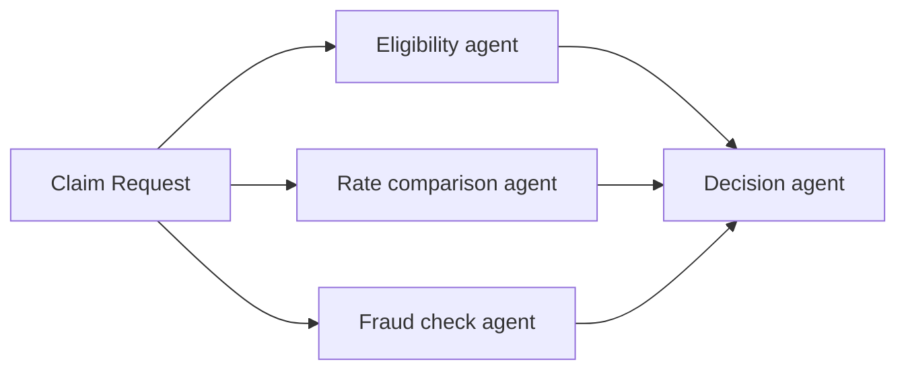

> ## Documentation Index
> Fetch the complete documentation index at: https://docs.restate.dev/llms.txt
> Use this file to discover all available pages before exploring further.

# Parallel Agents

> Fan out work to multiple agents, then combine the results. Failed agents are retried independently while successful results are preserved.

export const GitHubLink = ({url}) => <div style={{
  marginTop: '-8px',
  marginBottom: '8px',
  textAlign: 'right'
}}>
    <a href={url} target="_blank" rel="noopener noreferrer" style={{
  fontSize: '0.75rem',
  color: '#6B7280',
  textDecoration: 'none',
  display: 'inline-flex',
  alignItems: 'center',
  gap: '3px',
  padding: '2px 6px',
  borderRadius: '3px',
  border: '1px solid #E5E7EB',
  backgroundColor: 'transparent',
  transition: 'all 0.2s ease'
}} onMouseOver={e => {
  e.target.style.color = '#6B7280';
  e.target.style.backgroundColor = '#F9FAFB';
}} onMouseOut={e => {
  e.target.style.color = '#6B7280';
  e.target.style.backgroundColor = 'transparent';
}}>
      <svg width="12" height="12" viewBox="0 0 24 24" fill="currentColor">
        <path d="M12 0c-6.626 0-12 5.373-12 12 0 5.302 3.438 9.8 8.207 11.387.599.111.793-.261.793-.577v-2.234c-3.338.726-4.033-1.416-4.033-1.416-.546-1.387-1.333-1.756-1.333-1.756-1.089-.745.083-.729.083-.729 1.205.084 1.839 1.237 1.839 1.237 1.07 1.834 2.807 1.304 3.492.997.107-.775.418-1.305.762-1.604-2.665-.305-5.467-1.334-5.467-5.931 0-1.311.469-2.381 1.236-3.221-.124-.303-.535-1.524.117-3.176 0 0 1.008-.322 3.301 1.23.957-.266 1.983-.399 3.003-.404 1.02.005 2.047.138 3.006.404 2.291-1.552 3.297-1.230 3.297-1.230.653 1.653.242 2.874.118 3.176.77.84 1.235 1.911 1.235 3.221 0 4.609-2.807 5.624-5.479 5.921.43.372.823 1.102.823 2.222v3.293c0 .319.192.694.801.576 4.765-1.589 8.199-6.086 8.199-11.386 0-6.627-5.373-12-12-12z" />
      </svg>
      View on GitHub
    </a>
  </div>;

Fan out work to multiple agents, then combine the results. Restate runs the agents in parallel with automatic retries and recovery. If one agent fails, only that agent is retried, the successful results are preserved.



## Example: parallel claim analysis

Three specialist agents analyze a claim concurrently. A decision agent combines their results.

<Tabs>
  <Tab title="Vercel AI" icon="https://mintcdn.com/restate-6d46e1dc/MqWeXC2P3O-4Bva4/img/languages/typescript.svg?fit=max&auto=format&n=MqWeXC2P3O-4Bva4&q=85&s=62b813088c931e033d6f0c262315f8e8" width="800" height="800" data-path="img/languages/typescript.svg">
    ```typescript workflow-parallel.ts {"CODE_LOAD::https://raw.githubusercontent.com/restatedev/ai-examples/refs/heads/main/vercel-ai/tour-of-agents/src/workflow-parallel.ts#here"}  theme={null}
    const run = async (ctx: restate.Context, claim: ClaimInput) => {
      const [eligibility, rateComparison, fraudCheck] = await RestatePromise.all([
        ctx.serviceClient(eligibilityAgent).run(claim),
        ctx.serviceClient(rateComparisonAgent).run(claim),
        ctx.serviceClient(fraudCheckAgent).run(claim),
      ]);

      const model = wrapLanguageModel({
        model: openai("gpt-5.4"),
        middleware: durableCalls(ctx, { maxRetryAttempts: 3 }),
      });

      const { text } = await generateText({
        model,
        system: "You are a claim decision engine.",
        prompt: `Decide about claim ${JSON.stringify(claim)}.
            Base your decision on the following analyses:
            Eligibility: ${eligibility}, Cost: ${rateComparison} Fraud: ${fraudCheck}`,
      });
      return text;
    };
    ```

    <GitHubLink url="https://github.com/restatedev/ai-examples/tree/main/vercel-ai/tour-of-agents/src/workflow-parallel.ts" />

    <Accordion title="Try out parallel agents" icon="laptop">
      [Install Restate](/installation) and launch it:

      ```bash theme={null}
      npm install --global @restatedev/restate-server@latest @restatedev/restate@latest
      restate-server
      ```

      Get the example:

      ```bash theme={null}
      restate example typescript-vercel-ai-tour-of-agents && cd typescript-vercel-ai-tour-of-agents
      npm install
      ```

      Export your [OpenAI API key](https://platform.openai.com/api-keys) and run the agent:

      ```bash theme={null}
      export OPENAI_API_KEY=sk-...
      ```

      ```bash theme={null}
      npx tsx ./src/workflow-parallel.ts
      ```

      Register the agents with Restate:

      ```bash theme={null}
      restate deployments register http://localhost:9080 --force --yes # dev only: overrides previous registrations
      ```

      Start a request for a claim that needs to be analyzed by multiple agents in parallel:

      ```bash theme={null}
      curl localhost:8080/restate/call/ParallelAgentClaimApproval/run --json '{
          "date":"2024-10-01",
          "category":"orthopedic",
          "reason":"hospital bill for a broken leg",
          "amount":3000,
          "placeOfService":"General Hospital"
      }'
      ```

      In the UI, you can see that the handler called the sub-agents in parallel.
      Once all sub-agents return, the main agent makes a decision.

      <Frame>
        
      </Frame>
    </Accordion>
  </Tab>

  <Tab title="OpenAI Agents" icon="https://mintcdn.com/restate-6d46e1dc/MqWeXC2P3O-4Bva4/img/languages/python.svg?fit=max&auto=format&n=MqWeXC2P3O-4Bva4&q=85&s=67a6dbe92867a1d945bbe5940057662e" width="404" height="399" data-path="img/languages/python.svg">
    ```python workflow_parallel.py {"CODE_LOAD::https://raw.githubusercontent.com/restatedev/ai-examples/refs/heads/main/openai-agents/tour-of-agents/app/workflow_parallel.py#here"}  theme={null}
    @agent_service.handler()
    async def run(restate_context: restate.Context, claim: InsuranceClaim) -> str:
        # Start multiple agents in parallel with auto retries and recovery
        eligibility = restate_context.service_call(run_eligibility_agent, claim)
        cost = restate_context.service_call(run_rate_comparison_agent, claim)
        fraud = restate_context.service_call(run_fraud_agent, claim)

        # Wait for all responses
        await restate.gather(eligibility, cost, fraud)

        # Run decision agent on outputs
        result = await DurableRunner.run(
            Agent(
                name="ClaimApprovalAgent", instructions="You are a claim decision engine."
            ),
            input=f"Decide about claim: {claim.model_dump_json()}. "
            "Base your decision on the following analyses:"
            f"Eligibility: {await eligibility} Cost {await cost} Fraud: {await fraud}",
        )
        return result.final_output
    ```

    <GitHubLink url="https://github.com/restatedev/ai-examples/blob/main/openai-agents/tour-of-agents/app/workflow_parallel.py" />

    <Accordion title="Try out parallel agents" icon="laptop">
      [Install Restate](/installation) and launch it:

      ```bash theme={null}
      restate-server
      ```

      Get the example:

      ```bash theme={null}
      restate example python-openai-agents-tour-of-agents && cd python-openai-agents-tour-of-agents
      ```

      Export your [OpenAI API key](https://platform.openai.com/api-keys) and run the agent:

      ```bash theme={null}
      export OPENAI_API_KEY=sk-...
      ```

      ```bash theme={null}
      uv run app/workflow_parallel.py
      ```

      Register the agents with Restate:

      ```bash theme={null}
      restate deployments register http://localhost:9080 --force --yes # dev only: overrides previous registrations
      ```

      Start a request for a claim that needs to be analyzed by multiple agents in parallel:

      ```bash theme={null}
      curl localhost:8080/restate/call/ParallelAgentClaimApproval/run --json '{
          "date":"2024-10-01",
          "category":"orthopedic",
          "reason":"hospital bill for a broken leg",
          "amount":3000,
          "placeOfService":"General Hospital"
      }'
      ```

      In the UI, you can see that the handler called the sub-agents in parallel.
      Once all sub-agents return, the main agent makes a decision.

      <Frame>
        
      </Frame>
    </Accordion>
  </Tab>

  <Tab title="Google ADK" icon="https://mintcdn.com/restate-6d46e1dc/MqWeXC2P3O-4Bva4/img/languages/python.svg?fit=max&auto=format&n=MqWeXC2P3O-4Bva4&q=85&s=67a6dbe92867a1d945bbe5940057662e" width="404" height="399" data-path="img/languages/python.svg">
    ```python workflow_parallel.py {"CODE_LOAD::https://raw.githubusercontent.com/restatedev/ai-examples/refs/heads/main/google-adk/tour-of-agents/app/workflow_parallel.py#here"}  theme={null}
    @agent_service.handler()
    async def run(ctx: restate.ObjectContext, claim: InsuranceClaim) -> str | None:

        # Start multiple agents in parallel with auto retries and recovery
        eligibility = ctx.service_call(run_eligibility_agent, claim)
        cost = ctx.service_call(run_rate_comparison_agent, claim)
        fraud = ctx.service_call(run_fraud_agent, claim)

        # Wait for all responses
        await restate.gather(eligibility, cost, fraud)

        # Get the results
        eligibility_result = await eligibility
        cost_result = await cost
        fraud_result = await fraud

        # Run decision agent on outputs
        prompt = f"""Decide about claim: {claim.model_dump_json()}. Assessments:
        Eligibility: {eligibility_result} Cost: {cost_result} Fraud: {fraud_result}"""

        events = runner.run_async(
            user_id=ctx.key(),
            session_id=claim.session_id,
            new_message=Content(role="user", parts=[Part.from_text(text=prompt)]),
        )
        return await parse_agent_response(events)
    ```

    <GitHubLink url="https://github.com/restatedev/ai-examples/blob/main/google-adk/tour-of-agents/app/workflow_parallel.py" />

    <Accordion title="Try out parallel agents" icon="laptop">
      [Install Restate](/installation) and launch it:

      ```bash theme={null}
      restate-server
      ```

      Get the example:

      ```bash theme={null}
      restate example python-google-adk-tour-of-agents && cd python-google-adk-tour-of-agents
      ```

      Export your [Google API key](https://aistudio.google.com/app/apikey) and run the agent:

      ```bash theme={null}
      export GOOGLE_API_KEY=your-api-key
      ```

      ```bash theme={null}
      uv run app/workflow_parallel.py
      ```

      Register the agents with Restate:

      ```bash theme={null}
      restate deployments register http://localhost:9080 --force --yes # dev only: overrides previous registrations
      ```

      Start a request for a claim that needs to be analyzed by multiple agents in parallel:

      ```bash theme={null}
      curl localhost:8080/restate/call/ParallelAgentClaimApproval/user123/run --json '{
          "amount": 3000,
          "category": "orthopedic",
          "date": "2024-10-01",
          "placeOfService": "General Hospital",
          "reason": "hospital bill for a broken leg",
          "sessionId": "session-123"
      }'
      ```

      In the UI, you can see that the handler called the sub-agents in parallel.
      Once all sub-agents return, the main agent makes a decision.

      <Frame>
        
      </Frame>
    </Accordion>
  </Tab>

  <Tab title="Pydantic AI" icon="https://mintcdn.com/restate-6d46e1dc/MqWeXC2P3O-4Bva4/img/languages/python.svg?fit=max&auto=format&n=MqWeXC2P3O-4Bva4&q=85&s=67a6dbe92867a1d945bbe5940057662e" width="404" height="399" data-path="img/languages/python.svg">
    ```python workflow_parallel.py {"CODE_LOAD::https://raw.githubusercontent.com/restatedev/ai-examples/refs/heads/main/pydantic-ai/tour-of-agents/app/workflow_parallel.py#here"}  theme={null}
    @agent_service.handler()
    async def run(ctx: restate.Context, claim: InsuranceClaim) -> str:
        # Start multiple agents in parallel with auto retries and recovery
        eligibility = ctx.service_call(run_eligibility_agent, claim)
        cost = ctx.service_call(run_rate_comparison_agent, claim)
        fraud = ctx.service_call(run_fraud_agent, claim)

        # Wait for all responses
        await restate.gather(eligibility, cost, fraud)

        # Run decision agent on outputs
        result = await restate_decision_agent.run(
            f"Decide about claim: {claim.model_dump_json()}. "
            "Base your decision on the following analyses:"
            f"Eligibility: {await eligibility} Cost {await cost} Fraud: {await fraud}",
        )
        return result.output
    ```

    <GitHubLink url="https://github.com/restatedev/ai-examples/blob/main/pydantic-ai/tour-of-agents/app/workflow_parallel.py" />

    <Accordion title="Try out parallel agents" icon="laptop">
      [Install Restate](/installation) and launch it:

      ```bash theme={null}
      restate-server
      ```

      Get the example:

      ```bash theme={null}
      restate example python-pydantic-ai-tour-of-agents && cd python-pydantic-ai-tour-of-agents
      ```

      Export your [OpenAI API key](https://platform.openai.com/api-keys) and run the agent:

      ```bash theme={null}
      export OPENAI_API_KEY=sk-...
      ```

      ```bash theme={null}
      uv run app/workflow_parallel.py
      ```

      Register the agents with Restate:

      ```bash theme={null}
      restate deployments register http://localhost:9080 --force --yes # dev only: overrides previous registrations
      ```

      Start a request for a claim that needs to be analyzed by multiple agents in parallel:

      ```bash theme={null}
      curl localhost:8080/restate/call/ParallelAgentClaimApproval/run --json '{
          "date":"2024-10-01",
          "category":"orthopedic",
          "reason":"hospital bill for a broken leg",
          "amount":3000,
          "placeOfService":"General Hospital"
      }'
      ```

      In the UI, you can see that the handler called the sub-agents in parallel.
      Once all sub-agents return, the main agent makes a decision.

      <Frame>
        
      </Frame>
    </Accordion>
  </Tab>

  <Tab title="LangChain" icon="https://mintcdn.com/restate-6d46e1dc/MqWeXC2P3O-4Bva4/img/languages/python.svg?fit=max&auto=format&n=MqWeXC2P3O-4Bva4&q=85&s=67a6dbe92867a1d945bbe5940057662e" width="404" height="399" data-path="img/languages/python.svg">
    ```python workflow_parallel.py {"CODE_LOAD::https://raw.githubusercontent.com/restatedev/ai-examples/refs/heads/main/langchain-python/tour-of-agents/app/workflow_parallel.py#here"}  theme={null}
    decision = create_agent(
        model=init_chat_model("openai:gpt-5.4"),
        system_prompt="You are a claim decision engine.",
        middleware=[RestateMiddleware()],
    )


    agent_service = restate.Service("ParallelAgentClaimApproval")


    @agent_service.handler()
    async def run(ctx: restate.Context, claim: InsuranceClaim) -> str:
        # Start multiple sub-agents in parallel with auto-retries and recovery.
        eligibility = ctx.service_call(run_eligibility_agent, claim)
        cost = ctx.service_call(run_rate_comparison_agent, claim)
        fraud = ctx.service_call(run_fraud_agent, claim)

        await restate.gather(eligibility, cost, fraud)

        result = await decision.ainvoke(
            {"messages": f"""Decide about claim: {claim.model_dump_json()}.
            Base your decision on the following analyses:
            Eligibility: {await eligibility} Cost {await cost} Fraud: {await fraud}"""}
        )
        return result["messages"][-1].content
    ```

    <GitHubLink url="https://github.com/restatedev/ai-examples/blob/main/langchain-python/tour-of-agents/app/workflow_parallel.py" />

    <Accordion title="Try out parallel agents" icon="laptop">
      [Install Restate](/installation) and launch it:

      ```bash theme={null}
      restate-server
      ```

      Get the example:

      ```bash theme={null}
      restate example python-langchain-tour-of-agents && cd python-langchain-tour-of-agents
      ```

      Export your [OpenAI API key](https://platform.openai.com/api-keys) and run the agent:

      ```bash theme={null}
      export OPENAI_API_KEY=sk-...
      ```

      ```bash theme={null}
      uv run app/workflow_parallel.py
      ```

      Register the agents with Restate:

      ```bash theme={null}
      restate deployments register http://localhost:9080 --force --yes # dev only: overrides previous registrations
      ```

      Start a request for a claim that needs to be analyzed by multiple agents in parallel:

      ```bash theme={null}
      curl localhost:8080/restate/call/ParallelAgentClaimApproval/run --json '{
          "date":"2024-10-01",
          "category":"orthopedic",
          "reason":"hospital bill for a broken leg",
          "amount":3000,
          "placeOfService":"General Hospital"
      }'
      ```

      In the UI, you can see that the handler called the sub-agents in parallel.
      Once all sub-agents return, the main agent makes a decision.
    </Accordion>
  </Tab>

  <Tab title="Restate TS" icon="https://mintcdn.com/restate-6d46e1dc/MqWeXC2P3O-4Bva4/img/languages/typescript.svg?fit=max&auto=format&n=MqWeXC2P3O-4Bva4&q=85&s=62b813088c931e033d6f0c262315f8e8" width="800" height="800" data-path="img/languages/typescript.svg">
    ```typescript workflow-parallel.ts {"CODE_LOAD::https://raw.githubusercontent.com/restatedev/ai-examples/refs/heads/main/typescript-restate-only/tour-of-agents/src/workflow-parallel.ts#here"}  theme={null}
    async function run(ctx: Context, claim: ClaimInput) {
      // Create parallel tasks - each runs independently
      const claimJson = JSON.stringify(claim);
      const eligibility = ctx.run(
        "Eligibility agent",
        async () => llmCall(
            "Decide whether the following claim is eligible for reimbursement." +
            "Respond with eligible if it's a medical claim, and not eligible otherwise." +
            "\n\nClaim: " + claimJson,
        ),
        { maxRetryAttempts: 3 },
      )
      const fraud = ctx.run(
        "Fraud agent",
          async () => llmCall(
              "Decide whether the claim is fraudulent." +
              "Always respond with low risk, medium risk, or high risk." +
              "\n\nClaim: " + claimJson,
        ),
        { maxRetryAttempts: 3 },
      )
      const cost = ctx.run(
        "Rate comparison agent",
          async () => llmCall(
              "Decide whether the cost of the claim is reasonable given the treatment." +
              "Respond with reasonable or not reasonable." +
              "\n\nClaim: " + claimJson,
        ),
        { maxRetryAttempts: 3 },
      )

      // Wait for all tasks to complete and return the results
      await RestatePromise.all([eligibility, cost, fraud]);

      // Make final decision
      const { text } = await ctx.run(
          "Decision agent",
          async () => llmCall( `Decide about claim ${JSON.stringify(claim)}.
            Base your decision on the following analyses:
            - Eligibility: ${(await eligibility).text}, 
            - Cost: ${(await cost).text},
            - Fraud: ${(await fraud).text}`)
      );
      return text
    }
    ```

    <GitHubLink url="https://github.com/restatedev/ai-examples/blob/main/typescript-restate-only/tour-of-agents/src/workflow-parallel.ts" />

    <Accordion title="Run this example" icon="laptop">
      [Install Restate](/installation) and launch it:

      ```bash theme={null}
      restate-server
      ```

      Get the example:

      ```bash theme={null}
      restate example typescript-restate-tour-of-agents && cd typescript-restate-tour-of-agents
      npm install
      ```

      Export your API key:

      ```bash theme={null}
      export OPENAI_API_KEY=sk-...
      ```

      ```bash theme={null}
      npx tsx ./src/workflow-parallel.ts
      ```

      Register the services with Restate:

      ```bash theme={null}
      restate deployments register http://localhost:9080 --force --yes # dev only: overrides previous registrations
      ```

      Send a request:

      ```bash theme={null}
      curl localhost:8080/restate/call/ParallelAgentClaimApproval/run --json '{
          "date":"2024-10-01",
          "category":"orthopedic",
          "reason":"hospital bill for a broken leg",
          "amount":3000,
          "placeOfService":"General Hospital"
      }'
      ```
    </Accordion>
  </Tab>

  <Tab title="Restate Py" icon="https://mintcdn.com/restate-6d46e1dc/MqWeXC2P3O-4Bva4/img/languages/python.svg?fit=max&auto=format&n=MqWeXC2P3O-4Bva4&q=85&s=67a6dbe92867a1d945bbe5940057662e" width="404" height="399" data-path="img/languages/python.svg">
    ```python workflow_parallel.py {"CODE_LOAD::https://raw.githubusercontent.com/restatedev/ai-examples/refs/heads/main/python-restate-only/tour-of-agents/app/workflow_parallel.py#here"}  theme={null}
    parallelization_svc = restate.Service("ParallelAgentClaimApproval")


    @parallelization_svc.handler()
    async def run(ctx: restate.Context, claim: ClaimData) -> str | None:
        """Analyzes a claim in parallel with specialized agents."""

        # Create parallel tasks - each runs independently
        claim_json = json.dumps(claim.model_dump())
        eligibility = ctx.run_typed(
            "Eligibility agent",
            llm_call,
            RunOptions(max_attempts=3),
            messages="Decide whether the following claim is eligible for reimbursement."
            " Respond with eligible if it's a medical claim, and not eligible otherwise."
            f"\n\nClaim: {claim_json}",
        )
        fraud = ctx.run_typed(
            "Fraud agent",
            llm_call,
            RunOptions(max_attempts=3),
            messages="Decide whether the claim is fraudulent."
            " Always respond with low risk, medium risk, or high risk."
            f"\n\nClaim: {claim_json}",
        )
        rate = ctx.run_typed(
            "Rate comparison agent",
            llm_call,
            RunOptions(max_attempts=3),
            messages="Decide whether the cost of the claim is reasonable given the treatment."
            " Respond with reasonable or not reasonable."
            f"\n\nClaim: {claim_json}",
        )

        # Wait for all tasks to complete
        await restate.gather(eligibility, fraud, rate)

        # Make final decision
        decision = await ctx.run_typed(
            "Decision agent",
            llm_call,
            RunOptions(max_attempts=3),
            messages=f"Decide about claim: {claim.model_dump_json()}. "
            "Base your decision on the following analyses:"
            f"Eligibility: {(await eligibility).content} "
            f"Cost: {(await rate).content} "
            f"Fraud: {(await fraud).content}",
        )
        return decision.content
    ```

    <GitHubLink url="https://github.com/restatedev/ai-examples/blob/main/python-restate-only/tour-of-agents/app/workflow_parallel.py" />

    <Accordion title="Run this example" icon="laptop">
      [Install Restate](/installation) and launch it:

      ```bash theme={null}
      restate-server
      ```

      Get the example:

      ```bash theme={null}
      restate example python-restate-tour-of-agents && cd python-restate-tour-of-agents
      ```

      Export your API key:

      ```bash theme={null}
      export OPENAI_API_KEY=sk-...
      ```

      ```bash theme={null}
      uv run app/workflow_parallel.py
      ```

      Register the services with Restate:

      ```bash theme={null}
      restate deployments register http://localhost:9080 --force --yes # dev only: overrides previous registrations
      ```

      Send a request:

      ```bash theme={null}
      curl localhost:8080/restate/call/ParallelAgentClaimApproval/run --json '{
          "date":"2024-10-01",
          "category":"orthopedic",
          "reason":"hospital bill for a broken leg",
          "amount":3000,
          "placeOfService":"General Hospital"
      }'
      ```
    </Accordion>
  </Tab>
</Tabs>
