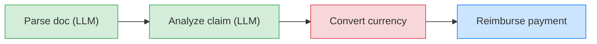

> ## Documentation Index
> Fetch the complete documentation index at: https://docs.restate.dev/llms.txt
> Use this file to discover all available pages before exploring further.

# Sequential Pipeline

> Chain agentic and traditional steps in sequence. Each step is recorded for automatic recovery.

export const GitHubLink = ({url}) => <div style={{
  marginTop: '-8px',
  marginBottom: '8px',
  textAlign: 'right'
}}>
    <a href={url} target="_blank" rel="noopener noreferrer" style={{
  fontSize: '0.75rem',
  color: '#6B7280',
  textDecoration: 'none',
  display: 'inline-flex',
  alignItems: 'center',
  gap: '3px',
  padding: '2px 6px',
  borderRadius: '3px',
  border: '1px solid #E5E7EB',
  backgroundColor: 'transparent',
  transition: 'all 0.2s ease'
}} onMouseOver={e => {
  e.target.style.color = '#6B7280';
  e.target.style.backgroundColor = '#F9FAFB';
}} onMouseOut={e => {
  e.target.style.color = '#6B7280';
  e.target.style.backgroundColor = 'transparent';
}}>
      <svg width="12" height="12" viewBox="0 0 24 24" fill="currentColor">
        <path d="M12 0c-6.626 0-12 5.373-12 12 0 5.302 3.438 9.8 8.207 11.387.599.111.793-.261.793-.577v-2.234c-3.338.726-4.033-1.416-4.033-1.416-.546-1.387-1.333-1.756-1.333-1.756-1.089-.745.083-.729.083-.729 1.205.084 1.839 1.237 1.839 1.237 1.07 1.834 2.807 1.304 3.492.997.107-.775.418-1.305.762-1.604-2.665-.305-5.467-1.334-5.467-5.931 0-1.311.469-2.381 1.236-3.221-.124-.303-.535-1.524.117-3.176 0 0 1.008-.322 3.301 1.23.957-.266 1.983-.399 3.003-.404 1.02.005 2.047.138 3.006.404 2.291-1.552 3.297-1.230 3.297-1.230.653 1.653.242 2.874.118 3.176.77.84 1.235 1.911 1.235 3.221 0 4.609-2.807 5.624-5.479 5.921.43.372.823 1.102.823 2.222v3.293c0 .319.192.694.801.576 4.765-1.589 8.199-6.086 8.199-11.386 0-6.627-5.373-12-12-12z" />
      </svg>
      View on GitHub
    </a>
  </div>;

Real-world workflows often mix LLM-powered steps (parsing documents, analyzing data) with traditional steps (API calls, database writes, payments). Restate lets you chain these together in a single durable pipeline where each step is persisted. If the process crashes after step 2 of 4, recovery skips the completed steps and resumes from step 3.

Chain agentic and traditional steps in sequence. Restate records the result of each step. On recovery:

* Completed steps are replayed instantly from the journal
* LLM calls are not repeated (saving cost and time)
* Regular steps (API calls, payments) are not duplicated



## Example: insurance claim reimbursement

This workflow processes an insurance claim through four steps: two agentic steps that use an LLM to understand unstructured data, and two traditional steps that call external APIs.

<Tabs>
  <Tab title="Vercel AI" icon="https://mintcdn.com/restate-6d46e1dc/MqWeXC2P3O-4Bva4/img/languages/typescript.svg?fit=max&auto=format&n=MqWeXC2P3O-4Bva4&q=85&s=62b813088c931e033d6f0c262315f8e8" width="800" height="800" data-path="img/languages/typescript.svg">
    ```typescript workflow-sequential.ts {"CODE_LOAD::https://raw.githubusercontent.com/restatedev/ai-examples/refs/heads/main/vercel-ai/tour-of-agents/src/workflow-sequential.ts#here"}  theme={null}
    const process = async (ctx: Context, {prompt}: {prompt: string}) => {
      const model = wrapLanguageModel({
        model: openai("gpt-5.4"),
        middleware: durableCalls(ctx, { maxRetryAttempts: 3 }),
      });

      // Step 1: Parse the claim document (LLM step)
      const { output } = await generateText({
        model,
        system:
          "Extract the claim amount, currency, category, and description.",
        prompt,
        output: Output.object({schema: ClaimData})
      });

      // Step 2: Analyze the claim (LLM step)
      const { output: valid } = await generateText({
        model,
        system:
          "You are a claims analyst. Assess whether this claim is valid and determine the approved amount.",
        prompt: `Claim: ${JSON.stringify(output)}`,
        output: Output.object({schema: z.object({valid: z.boolean()})}),
      });

      if (!valid) {
        return { analysis: "Claim is invalid", amountUsd: 0, confirmation: false };
      }

      // Step 3: Convert currency (regular step)
      const amountUsd = await ctx.run("Convert currency", async () =>
        convertCurrency(output.amount, output.currency, "USD"),
      );

      // Step 4: Process reimbursement (regular step)
      const confirmation = await ctx.run("Process payment", async () =>
        processPayment(ctx.rand.uuidv4(), amountUsd),
      );

      return { analysis: "Claim is valid", amountUsd, confirmation };
    };
    ```

    <GitHubLink url="https://github.com/restatedev/ai-examples/blob/main/vercel-ai/tour-of-agents/src/workflow-sequential.ts" />

    <Accordion title="Run this example" icon="laptop">
      [Install Restate](/installation) and launch it:

      ```bash theme={null}
      npm install --global @restatedev/restate-server@latest @restatedev/restate@latest
      restate-server
      ```

      Get the example:

      ```bash theme={null}
      restate example typescript-vercel-ai-tour-of-agents && cd typescript-vercel-ai-tour-of-agents
      npm install
      ```

      Export your [OpenAI API key](https://platform.openai.com/api-keys) and run the agent:

      ```bash theme={null}
      export OPENAI_API_KEY=sk-...
      ```

      ```bash theme={null}
      npx tsx ./src/workflow-sequential.ts
      ```

      Register the agents with Restate:

      ```bash theme={null}
      restate deployments register http://localhost:9080 --force --yes # dev only: overrides previous registrations
      ```

      Send a request to the agent:

      ```shell theme={null}
      curl localhost:8080/restate/call/ClaimReimbursement/process --json '{
          "prompt": "Process my hospital bill of 2024-10-01 for 3000USD for a broken leg at General Hospital."
      }'
      ```
    </Accordion>
  </Tab>

  <Tab title="OpenAI Agents" icon="https://mintcdn.com/restate-6d46e1dc/MqWeXC2P3O-4Bva4/img/languages/python.svg?fit=max&auto=format&n=MqWeXC2P3O-4Bva4&q=85&s=67a6dbe92867a1d945bbe5940057662e" width="404" height="399" data-path="img/languages/python.svg">
    ```python workflow_sequential.py {"CODE_LOAD::https://raw.githubusercontent.com/restatedev/ai-examples/refs/heads/main/openai-agents/tour-of-agents/app/workflow_sequential.py#here"}  theme={null}
    claim_service = restate.Service("ClaimReimbursement")


    @claim_service.handler()
    async def process(ctx: restate.Context, req: ClaimPrompt) -> dict:
        # Step 1: Parse the claim document (LLM step)
        parse_agent = Agent(
            name="DocumentParser",
            instructions="Extract the claim amount, currency, category, and description.",
            output_type=ClaimData,
        )
        parsed = await DurableRunner.run(parse_agent, req.message)
        claim = parsed.final_output

        # Step 2: Analyze the claim (LLM step)
        analysis_agent = Agent(
            name="ClaimsAnalyst",
            instructions="Assess whether this claim is valid and determine the approved amount.",
        )
        analysis = await DurableRunner.run(
            analysis_agent, f"Claim: {parsed.final_output.model_dump_json()}"
        )

        # Step 3: Convert currency (regular step)
        amount_usd = await ctx.run_typed(
            "Convert currency",
            convert_currency,
            amount=claim.amount,
            source=claim.currency,
            target="USD",
        )

        # Step 4: Process reimbursement (regular step)
        confirmation = await ctx.run_typed(
            "Process payment",
            process_payment,
            claim_id=str(ctx.uuid()),
            amount=amount_usd,
        )

        return {
            "analysis": analysis.final_output,
            "amount_usd": amount_usd,
            "confirmation": confirmation,
        }
    ```

    <GitHubLink url="https://github.com/restatedev/ai-examples/blob/main/openai-agents/tour-of-agents/app/workflow_sequential.py" />

    <Accordion title="Run this example" icon="laptop">
      [Install Restate](/installation) and launch it:

      ```bash theme={null}
      restate-server
      ```

      Get the example:

      ```bash theme={null}
      restate example python-openai-agents-tour-of-agents && cd python-openai-agents-tour-of-agents
      ```

      Export your [OpenAI API key](https://platform.openai.com/api-keys) and run the agent:

      ```bash theme={null}
      export OPENAI_API_KEY=sk-...
      ```

      ```bash theme={null}
      uv run app/workflow_sequential.py
      ```

      Register the agents with Restate:

      ```bash theme={null}
      restate deployments register http://localhost:9080 --force --yes # dev only: overrides previous registrations
      ```

      Send a request:

      ```bash theme={null}
      curl localhost:8080/restate/call/ClaimReimbursement/process --json '{
          "message": "Process my hospital bill of 2024-10-01 for 3000USD for a broken leg at General Hospital."
      }'
      ```
    </Accordion>
  </Tab>

  <Tab title="Google ADK" icon="https://mintcdn.com/restate-6d46e1dc/MqWeXC2P3O-4Bva4/img/languages/python.svg?fit=max&auto=format&n=MqWeXC2P3O-4Bva4&q=85&s=67a6dbe92867a1d945bbe5940057662e" width="404" height="399" data-path="img/languages/python.svg">
    ```python workflow_sequential.py {"CODE_LOAD::https://raw.githubusercontent.com/restatedev/ai-examples/refs/heads/main/google-adk/tour-of-agents/app/workflow_sequential.py#here"}  theme={null}
    parse_agent = Agent(
        model="gemini-2.5-flash",
        name="document_parser",
        instruction="Extract the claim amount, currency, category, and description.",
        output_schema=ClaimData,
    )
    parse_app = App(name="claims", root_agent=parse_agent, plugins=[RestatePlugin()])
    parse_runner = Runner(app=parse_app, session_service=RestateSessionService())

    analysis_agent = Agent(
        model="gemini-2.5-flash",
        name="claims_analyst",
        instruction="Assess whether this claim is valid and determine the approved amount.",
    )
    analysis_app = App(name="claims", root_agent=analysis_agent, plugins=[RestatePlugin()])
    analysis_runner = Runner(app=analysis_app, session_service=RestateSessionService())

    claim_service = restate.VirtualObject("ClaimReimbursement")


    @claim_service.handler()
    async def process(ctx: restate.ObjectContext, req: ClaimPrompt) -> dict:
        # Step 1: Parse the claim document (LLM step)
        parsing_events = parse_runner.run_async(
            user_id=ctx.key(),
            session_id=req.session_id,
            new_message=Content(role="user", parts=[Part.from_text(text=req.message)]),
        )
        parsed = await parse_agent_response(parsing_events)
        claim = ClaimData.model_validate_json(parsed)

        # Step 2: Analyze the claim (LLM step)
        analysis_events = analysis_runner.run_async(
            user_id=ctx.key(),
            session_id=req.session_id,
            new_message=Content(role="user", parts=[Part.from_text(text=parsed)]),
        )
        analysis = await parse_agent_response(analysis_events)

        # Step 3: Convert currency (regular step)
        amount_usd = await ctx.run_typed(
            "Convert currency",
            convert_currency,
            amount=claim.amount,
            source=claim.currency,
            target="USD",
        )

        # Step 4: Process reimbursement (regular step)
        confirmation = await ctx.run_typed(
            "Process payment",
            process_payment,
            claim_id=str(ctx.uuid()),
            amount=amount_usd,
        )

        return {
            "analysis": analysis,
            "amount_usd": amount_usd,
            "confirmation": confirmation,
        }
    ```

    <GitHubLink url="https://github.com/restatedev/ai-examples/blob/main/google-adk/tour-of-agents/app/workflow_sequential.py" />

    <Accordion title="Run this example" icon="laptop">
      [Install Restate](/installation) and launch it:

      ```bash theme={null}
      restate-server
      ```

      Get the example:

      ```bash theme={null}
      restate example python-google-adk-tour-of-agents && cd python-google-adk-tour-of-agents
      ```

      Export your [Google API key](https://aistudio.google.com/app/apikey) and run the agent:

      ```bash theme={null}
      export GOOGLE_API_KEY=your-api-key
      ```

      ```bash theme={null}
      uv run app/workflow_sequential.py
      ```

      Register the agents with Restate:

      ```bash theme={null}
      restate deployments register http://localhost:9080 --force --yes # dev only: overrides previous registrations
      ```

      Send a request:

      ```bash theme={null}
      curl localhost:8080/restate/call/ClaimReimbursement/user123/process \
        --json '{
          "sessionId": "session-123",
          "message": "Hospital bill for a broken leg. Amount: 3000 EUR. Date: 2024-10-01. Hospital: General Hospital."
        }'
      ```
    </Accordion>
  </Tab>

  <Tab title="Pydantic AI" icon="https://mintcdn.com/restate-6d46e1dc/MqWeXC2P3O-4Bva4/img/languages/python.svg?fit=max&auto=format&n=MqWeXC2P3O-4Bva4&q=85&s=67a6dbe92867a1d945bbe5940057662e" width="404" height="399" data-path="img/languages/python.svg">
    ```python workflow_sequential.py {"CODE_LOAD::https://raw.githubusercontent.com/restatedev/ai-examples/refs/heads/main/pydantic-ai/tour-of-agents/app/workflow_sequential.py#here"}  theme={null}
    parse_agent = Agent(
        "openai:gpt-5.4",
        system_prompt="Extract the claim amount, currency, category, and description.",
        output_type=ClaimData,
    )
    restate_parse_agent = RestateAgent(parse_agent)

    analysis_agent = Agent(
        "openai:gpt-5.4",
        system_prompt="Analyze the claim and approve/deny it.",
        output_type=bool,
    )
    restate_analysis_agent = RestateAgent(analysis_agent)

    claim_service = restate.Service("ClaimReimbursement")


    @claim_service.handler()
    async def process(ctx: restate.Context, req: ClaimPrompt) -> dict:
        # Step 1: Parse the claim document (LLM step)
        parsed = await restate_parse_agent.run(req.message)
        claim = parsed.output

        # Step 2: Analyze the claim (LLM step)
        approved = await restate_analysis_agent.run(f"Claim: {claim.model_dump_json()}")
        if not approved.output:
            return {"analysis": "Claim is invalid", "amountUsd": 0, "confirmation": False}

        # Step 3: Convert currency (regular step)
        amount_usd = await ctx.run_typed(
            "Convert currency",
            convert_currency,
            amount=claim.amount,
            source=claim.currency,
            target="USD",
        )

        # Step 4: Process reimbursement (regular step)
        confirmation = await ctx.run_typed(
            "Process payment",
            process_payment,
            claim_id=str(ctx.uuid()),
            amount=amount_usd,
        )

        return {
            "analysis": "Claim is valid.",
            "amount_usd": amount_usd,
            "confirmation": confirmation,
        }
    ```

    <GitHubLink url="https://github.com/restatedev/ai-examples/blob/main/pydantic-ai/tour-of-agents/app/workflow_sequential.py" />

    <Accordion title="Run this example" icon="laptop">
      [Install Restate](/installation) and launch it:

      ```bash theme={null}
      restate-server
      ```

      Get the example:

      ```bash theme={null}
      restate example python-pydantic-ai-tour-of-agents && cd python-pydantic-ai-tour-of-agents
      ```

      Export your [OpenAI API key](https://platform.openai.com/api-keys) and run the agent:

      ```bash theme={null}
      export OPENAI_API_KEY=sk-...
      ```

      ```bash theme={null}
      uv run app/workflow_sequential.py
      ```

      Register the agents with Restate:

      ```bash theme={null}
      restate deployments register http://localhost:9080 --force --yes # dev only: overrides previous registrations
      ```

      Send a request:

      ```bash theme={null}
      curl localhost:8080/restate/call/ClaimReimbursement/process --json '{
          "message": "Process my hospital bill of 2024-10-01 for 3000USD for a broken leg at General Hospital."
      }'
      ```
    </Accordion>
  </Tab>

  <Tab title="LangChain" icon="https://mintcdn.com/restate-6d46e1dc/MqWeXC2P3O-4Bva4/img/languages/python.svg?fit=max&auto=format&n=MqWeXC2P3O-4Bva4&q=85&s=67a6dbe92867a1d945bbe5940057662e" width="404" height="399" data-path="img/languages/python.svg">
    ```python workflow_sequential.py {"CODE_LOAD::https://raw.githubusercontent.com/restatedev/ai-examples/refs/heads/main/langchain-python/tour-of-agents/app/workflow_sequential.py#here"}  theme={null}
    parse_agent = create_agent(
        model=init_chat_model("openai:gpt-5.4"),
        system_prompt="Extract the claim amount, currency, category, and description.",
        response_format=ClaimData,
        middleware=[RestateMiddleware()],
    )


    analysis_agent = create_agent(
        model=init_chat_model("openai:gpt-5.4"),
        system_prompt="Assess whether this claim is valid and determine the approved amount.",
        middleware=[RestateMiddleware()],
    )


    claim_service = restate.Service("ClaimReimbursement")


    @claim_service.handler()
    async def process(ctx: restate.Context, req: ClaimPrompt) -> dict:
        # Step 1: Parse the claim document (structured-output LLM step).
        parsed = await parse_agent.ainvoke({"messages": req.message})
        claim = parsed["structured_response"]

        # Step 2: Analyze the claim (LLM step).
        analysis = await analysis_agent.ainvoke({"messages": claim.model_dump_json()})

        # Step 3: Convert currency (regular durable step).
        amount_usd = await ctx.run_typed(
            "Convert currency",
            convert_currency,
            amount=claim.amount,
            source=claim.currency,
            target="USD",
        )

        # Step 4: Process reimbursement (regular durable step).
        confirmation = await ctx.run_typed(
            "Process payment",
            process_payment,
            claim_id=str(ctx.uuid()),
            amount=amount_usd,
        )

        return {
            "analysis": analysis["messages"][-1].content,
            "amount_usd": amount_usd,
            "confirmation": confirmation,
        }
    ```

    <GitHubLink url="https://github.com/restatedev/ai-examples/blob/main/langchain-python/tour-of-agents/app/workflow_sequential.py" />

    <Accordion title="Run this example" icon="laptop">
      [Install Restate](/installation) and launch it:

      ```bash theme={null}
      restate-server
      ```

      Get the example:

      ```bash theme={null}
      restate example python-langchain-tour-of-agents && cd python-langchain-tour-of-agents
      ```

      Export your [OpenAI API key](https://platform.openai.com/api-keys) and run the agent:

      ```bash theme={null}
      export OPENAI_API_KEY=sk-...
      ```

      ```bash theme={null}
      uv run app/workflow_sequential.py
      ```

      Register the agents with Restate:

      ```bash theme={null}
      restate deployments register http://localhost:9080 --force --yes # dev only: overrides previous registrations
      ```

      Send a request:

      ```bash theme={null}
      curl localhost:8080/restate/call/ClaimReimbursement/process --json '{
          "message": "Process my hospital bill of 2024-10-01 for 3000USD for a broken leg at General Hospital."
      }'
      ```
    </Accordion>
  </Tab>

  <Tab title="Restate TS" icon="https://mintcdn.com/restate-6d46e1dc/MqWeXC2P3O-4Bva4/img/languages/typescript.svg?fit=max&auto=format&n=MqWeXC2P3O-4Bva4&q=85&s=62b813088c931e033d6f0c262315f8e8" width="800" height="800" data-path="img/languages/typescript.svg">
    ```typescript workflow-sequential.ts {"CODE_LOAD::https://raw.githubusercontent.com/restatedev/ai-examples/refs/heads/main/typescript-restate-only/tour-of-agents/src/workflow-sequential.ts#here"}  theme={null}
    async function process(ctx: Context, { message }: { message: string }) {
      // Step 1: Parse the claim document (LLM step)
      const { output } = await ctx.run(
        "Parse claim",
        async () => {
          const { output } = await generateText({
            model: openai("gpt-5.4"),
            prompt: `Extract the claim amount, currency, category, and description. Input: ${message}`,
            output: Output.object({ schema: ClaimData }),
          });
          return { output };
        },
        { maxRetryAttempts: 3 },
      );

      // Step 2: Evaluate the claim (LLM step)
      const { valid } = await ctx.run(
        "Evaluate claim",
        async () => {
          const { output: valid } = await generateText({
            model: openai("gpt-5.4"),
            system:
              "You are a claims analyst. Assess whether this claim is valid and determine the approved amount.",
            prompt: `Claim: ${JSON.stringify(output)}`,
            output: Output.object({schema: z.object({valid: z.boolean()})}),
          });
          return valid;
        },
        { maxRetryAttempts: 3 },
      );

      if (!valid) {
        return { analysis: "Claim is invalid", amountUsd: 0, confirmation: false };
      }

      // Step 3: Convert currency (regular step)
      const amountUsd = await ctx.run("Convert currency", async () =>
        convertCurrency(output.amount, output.currency, "USD"),
      );

      // Step 4: Process reimbursement (regular step)
      const confirmation = await ctx.run("Process payment", async () =>
        processPayment(ctx.rand.uuidv4(), amountUsd),
      );

      return { analysis: "Claim is valid", amountUsd, confirmation };
    }
    ```

    <GitHubLink url="https://github.com/restatedev/ai-examples/blob/main/typescript-restate-only/tour-of-agents/src/workflow-sequential.ts" />

    <Accordion title="Run this example" icon="laptop">
      [Install Restate](/installation) and launch it:

      ```bash theme={null}
      restate-server
      ```

      Get the example:

      ```bash theme={null}
      restate example typescript-restate-tour-of-agents && cd typescript-restate-tour-of-agents
      npm install
      ```

      Export your API key:

      ```bash theme={null}
      export OPENAI_API_KEY=sk-...
      ```

      ```bash theme={null}
      npx tsx ./src/workflow-sequential.ts
      ```

      Register the services with Restate:

      ```bash theme={null}
      restate deployments register http://localhost:9080 --force --yes # dev only: overrides previous registrations
      ```

      Send a request:

      ```bash theme={null}
      curl localhost:8080/restate/call/ClaimReimbursement/process --json '{
          "message": "Process my hospital bill of 2024-10-01 for 3000USD for a broken leg at General Hospital."
      }'
      ```
    </Accordion>
  </Tab>

  <Tab title="Restate Py" icon="https://mintcdn.com/restate-6d46e1dc/MqWeXC2P3O-4Bva4/img/languages/python.svg?fit=max&auto=format&n=MqWeXC2P3O-4Bva4&q=85&s=67a6dbe92867a1d945bbe5940057662e" width="404" height="399" data-path="img/languages/python.svg">
    ```python workflow_sequential.py {"CODE_LOAD::https://raw.githubusercontent.com/restatedev/ai-examples/refs/heads/main/python-restate-only/tour-of-agents/app/workflow_sequential.py#here"}  theme={null}
    claim_service = restate.Service("ClaimReimbursement")


    @claim_service.handler()
    async def process(ctx: restate.Context, req: ClaimPrompt) -> dict:
        """Sequentially chains LLM calls with regular function calls to process a claim."""

        # Step 1: Parse the claim document (LLM step)
        parsed = await ctx.run_typed(
            "Parse claim document",
            llm_call,
            RunOptions(max_attempts=3),
            messages=f"""Extract the claim amount, currency, category, and description.
            Document: {req.message}""",
            response_format=ClaimData,
        )
        if not parsed.content:
            raise restate.TerminalError("LLM failed to parse claim document.")
        claim = ClaimData.model_validate_json(parsed.content)

        # Step 2: Analyze the claim (LLM step)
        response = await ctx.run_typed(
            "Evaluate claim",
            llm_call,
            RunOptions(max_attempts=3),
            messages=f"""Assess whether this claim is valid and determine the approved amount.
            Claim: {parsed.content}""",
            response_format=ClaimEvaluation,
        )
        if not response.content:
            raise restate.TerminalError("LLM failed to analyze claim.")
        evaluation = ClaimEvaluation.model_validate_json(response.content)
        if not evaluation.valid:
            return {"analysis": "Claim is invalid."}


        # Step 3: Convert currency (regular step)
        amount_usd = await ctx.run_typed(
            "Convert currency",
            convert_currency,
            amount=claim.amount,
            source=claim.currency,
            target="USD",
        )

        # Step 4: Process reimbursement (regular step)
        confirmation = await ctx.run_typed(
            "Process payment",
            process_payment,
            claim_id=str(ctx.uuid()),
            amount=amount_usd,
        )

        return {
            "analysis": "Claim is valid.",
            "amount_usd": amount_usd,
            "confirmation": confirmation,
        }
    ```

    <GitHubLink url="https://github.com/restatedev/ai-examples/blob/main/python-restate-only/tour-of-agents/app/workflow_sequential.py" />

    <Accordion title="Run this example" icon="laptop">
      [Install Restate](/installation) and launch it:

      ```bash theme={null}
      restate-server
      ```

      Get the example:

      ```bash theme={null}
      restate example python-restate-tour-of-agents && cd python-restate-tour-of-agents
      ```

      Export your API key:

      ```bash theme={null}
      export OPENAI_API_KEY=sk-...
      ```

      ```bash theme={null}
      uv run app/workflow_sequential.py
      ```

      Register the services with Restate:

      ```bash theme={null}
      restate deployments register http://localhost:9080 --force --yes # dev only: overrides previous registrations
      ```

      Send a request:

      ```bash theme={null}
      curl localhost:8080/restate/call/ClaimReimbursement/process --json '{
          "message": "Process my hospital bill of 2024-10-01 for 3000USD for a broken leg at General Hospital."
      }'
      ```
    </Accordion>
  </Tab>
</Tabs>

If the process crashes after the LLM analysis but before the payment, Restate recovers both LLM results from the journal and continues with the currency conversion. No LLM calls are repeated, no payments are duplicated.
