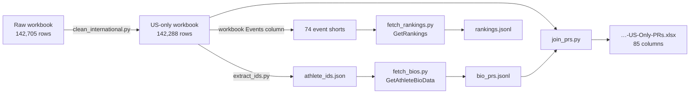

# Athletic.net PR Population — US Boys Grade 11 (Class of 2027)

> **Archived 2026-09-21.** The Python scripts this directory documented have been deleted — the
> repository runs no Python (owner directive). The pipeline's outputs (the workbooks and CSVs under
> `reports/`) and this README remain as the provenance record of the 2026-09-20 corpus build. The
> acquisition it described now lives in the Rust pipeline (`crates/census-service` bio adapter;
> endpoint contracts in `docs/API.md`).

Tooling that turns the raw Athletic.net rankings projection
(`Athletic-2026-US-Boys-Grade11-All-Athletes.xlsx`) into a cleaned, PR-populated
workbook.

The source workbook is a **rankings projection that dropped the marks**. It carries
`AthleteID / Names / GradeID / Teams / States / Events / Result Count / Other Observed
Grades / Identity Match Status` — but **no times or distances**. Every PR in the output
is therefore re-derived from Athletic.net itself.



Two fetching routes exist. They are **alternatives, not both required**:

| Route | Requests | Mark scope | Notes |
|---|---|---|---|
| `fetch_bios.py` (`GetAthleteBioData`) | 1 per athlete (~142k) | all-time PR + 2026 season best, **per event** | the route actually used; too slow to enumerate for large cohorts |
| `fetch_rankings.py` (`GetRankings`) | 74 shorts x pages (~4k) | the single ranked row (best mark in the list) | cheap; only covers athletes who appear in the national list |

`join_prs.py` consumes `bio_prs.jsonl` (route 1). Point it at the rankings JSONL instead if
you take route 2.

---

## Verified API contract

Both endpoints are anonymous — **no session token / no cookies** required. A browser-grade
header set is mandatory; a default `curl` UA gets the 403 interstitial.

```
POST https://www.athletic.net/api/v1/tfRankings/GetRankings
Content-Type: application/json
```

```json
{"reportType":"div","mode":"list","divListId":168416,"indoor":null,
 "eventShort":"100m","gender":"m","qParams":{"grades":[11],"page":1},
 "qualifyingListKey":"","version":2,"debug":""}
```

* `divListId: 168416` = national boys; `gender: "m"`; `grades: [11]` = class of 2027.
* Response: `groupedRankings` (list of lists of rows), `relayTeams`, `minCount`,
  `eventShort`, `gender`. 101 rows/page; page until empty.
* Row fields: `AthleteID, AthleteName, GradeID, TeamID, TeamName, State, Event,
  EventShort, display, SortIntRaw, PersonalBest, PersonalEvent, SeasonID, ResultDate,
  MeetID, IDResult`. **`display` is the mark**; `SortIntRaw` min = best, uniformly.

```
GET https://www.athletic.net/api/v1/athlete/<AthleteID>/GetAthleteBioData
```

Used by `fetch_bios.py`; returns per-event PRs as
`{Event: {Result, SortIntRaw, SeasonID, ...}}`. All-time PR = min `SortIntRaw` across
seasons; 2026 PR = min restricted to `SeasonID` 12026/2026.

### Field vs track vs relay

* **Field events** return metric `display` (`"20.51m"`, `"7.87m"`); imperial is in
  `SortIntRaw` (`20'4.5"`). `SortIntRaw` is event-specific fixed-point — **never** compare
  it across events, only within one.
* **Invalid marks** (`ND`, `NH`, `FOUL`, `DNS`, `DNF`, `X`) carry a sentinel like
  `SortIntRaw = 20000001` and no digits in `Result`. Filter with "no digit in `Result`".
* **Relays** (`4x100m`, `distmed*`, `sprintmed*`, `swedish1234`, `*shuttleh*`,
  `decathlon`/`heptathlon`/`pentathlon`): `grades:[11]` returns **0 rows** — relay rows
  carry the placeholder `GradeID = 99`. Query with `grades:[]` instead.

---

## Scripts

| File | Role |
|---|---|
| `clean_international.py` | Drops international athletes. Keeps a row iff >= 1 `States`-column token is a 50-state+DC code. Removed 417 (75 non-US state token, 342 international team name). Emits a breakdown. |
| `extract_ids.py` | Pulls the `AthleteID` column into `athlete_ids.json` for the fetcher. |
| `fetch_bios.py` | **Primary fetcher.** `GetAthleteBioData` for every athlete; emits one JSONL line of all-time + 2026 PR per event. Resumable, throttled, retrying. |
| `fetch_rankings.py` | Alternative fetcher over the 74 event shorts; paginated, checkpointed. |
| `join_prs.py` | Joins the JSONL back onto the workbook and writes the output xlsx. |
| `pipeline_finish.py` | Watches the fetch PID, then runs the join automatically; writes `JOIN_DONE`. |
| `verify_xlsx.py` | Structural check of the produced xlsx (zip CRCs, header, row shape). |
| `probe_getrankings.py` | One-shot probe of the `GetRankings` contract. |
| `probe_event_shorts.py` | Confirms field-event / relay `display` shapes. |
| `probe_lists.py` | Enumerates available rankings lists. |

### Fetcher discipline (`fetch_bios.py`)

* **Adaptive throttle** — targets 0.85 s/request (`TARGET_PERIOD`), sleeping
  `max(0, TARGET - elapsed)`. Holds ~1.2 req/s regardless of latency jitter. Measured
  429 ceiling is ~2.1 req/s; 1.25 req/s sustained never tripped it.
* **Backoff** on 429/5xx honouring `Retry-After`; a fresh connection on each retry; retry
  budget of 3.
* **Resumable** — the output JSONL is the checkpoint (`done-set`); re-running skips
  finished athletes.
* Env knobs: `LIMIT` (smoke test), `BASE_DELAY`, `TARGET_PERIOD`.

---

## Output

`join_prs.py` produces `<workbook>-US-Only-PRs.xlsx`, 85 columns:

1. the original 9 columns, untouched;
2. `SchoolID` — the bio `SchoolID` (stable id; the `Teams` column only holds the name);
3. **74 wide per-event PR columns**, ordered by frequency (`100m, 200m, 400m, 800m, shot,
   1600m, discus, lj, 3200m, 4x100m, …`);
4. `PR Matched` — how many of that athlete's listed events resolved to a PR.

Written by rebuilding `xl/worksheets/sheet1.xml` inside a copy of the original zip and
re-emitting every other part verbatim — no `openpyxl` / `xlsxwriter` needed. Empty cells
are emitted sparsely, so the output stays small.

## Caveats

* Paths are absolute (`/home/lewis/Downloads/...`) — parameterise before reuse.
* No `requests` / `openpyxl` on the host; everything is stdlib (`urllib.request`,
  `zipfile`, `re`, `ElementTree`).
* Data artefacts (`*.xlsx`, `*.jsonl`, `*.csv`) are `.gitignore`d and **not** committed —
  only the tooling is.
* Re-fetching from Athletic.net is a bounded, throttled operation; keep it polite.
